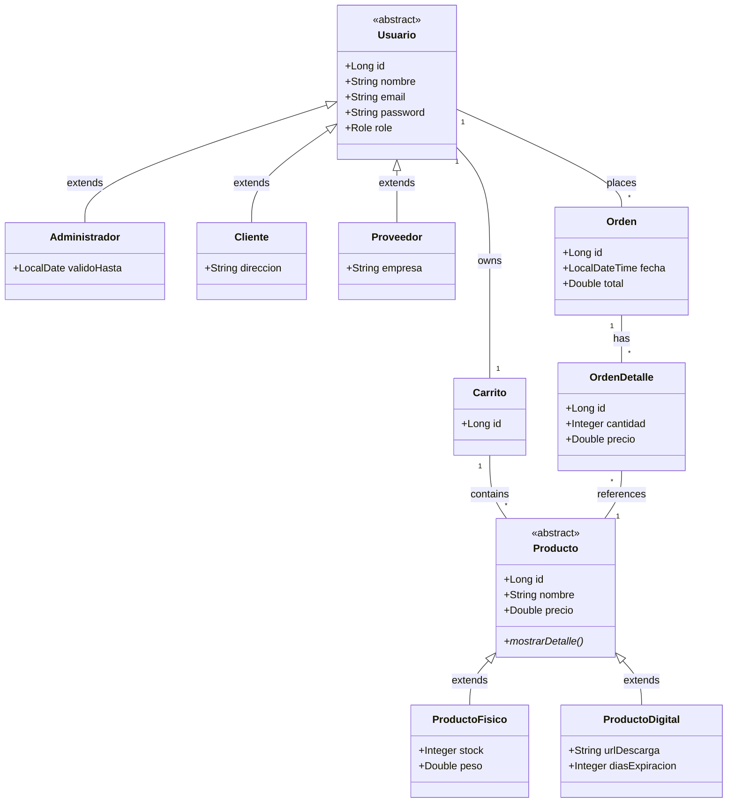

# E-Commerce Backend v1.0

## 🎯 Propósito del Backend

Este backend es el núcleo de la solución E-Commerce, proporcionando una **API REST** completa para la gestión de productos, usuarios, carritos de compra y órdenes, con un sistema robusto de autenticación y autorización basado en roles (RBAC).

- Autor: Ramón Bolívar Cuevas Escobar

- Módulo: Object-Oriented Programming (CSE6041)

- Profesor: Dr. José Ignacio Requeno Jarabo

### Rol dentro de la Solución
- **Capa de Negocio**: Validaciones, lógica de dominio, transacciones
- **Persistencia**: Gestión de base de datos MySQL con JPA/Hibernate
- **Seguridad**: Autenticación con tokens y autorización granular
- **API REST**: Endpoints RESTful para comunicación con frontend

---

## 🏛️ Arquitectura Orientada a Objetos

### Tipo de Arquitectura
**Arquitectura en Capas (Layered Architecture)** con separación de responsabilidades:

```
┌─────────────────────────────────────┐
│  CONTROLLER LAYER (API REST)        │  ← Exposición HTTP
├─────────────────────────────────────┤
│  SERVICE LAYER (Lógica de Negocio)  │  ← Transacciones
├─────────────────────────────────────┤
│  REPOSITORY LAYER (Persistencia)    │  ← JPA/Hibernate
├─────────────────────────────────────┤
│  MODEL LAYER (Entidades de Dominio) │  ← OOP Puro
└─────────────────────────────────────┘
         ↓
    MySQL Database

```

### Responsabilidades por Capa

#### 1. **Controller** (Endpoints REST)
- Recibir peticiones HTTP
- Validar datos de entrada
- Delegar lógica al Service
- Retornar respuestas HTTP (JSON)

```java
@RestController
@RequestMapping("/api/usuarios")
public class UsuarioController {
    @Autowired
    private UsuarioService usuarioService;
    
    @GetMapping
    @PreAuthorize("hasRole('ADMIN')")
    public List<Usuario> listarUsuarios() { /* ... */ }
}
```

#### 2. **Service** (Lógica de Negocio)
- Validaciones de negocio
- Transacciones (`@Transactional`)
- Encriptación de contraseñas
- Coordinación entre repositorios

```java
@Service
public class UsuarioService {
    @Transactional
    public Usuario registrarUsuario(Usuario usuario) {
        // Validar email único
        // Encriptar contraseña
        // Guardar en BD
    }
}
```

#### 3. **Repository** (Acceso a Datos)
- Extensión de `JpaRepository`
- Queries personalizadas
- Abstracción de la BD

```java
public interface UsuarioRepository extends JpaRepository<Usuario, Long> {
    Optional<Usuario> findByEmail(String email);
    boolean existsByEmail(String email);
}
```

#### 4. **Model** (Entidades de Dominio)
- Representación de objetos de negocio
- Anotaciones JPA (`@Entity`, `@Table`)
- Relaciones entre entidades
- Jerarquías de herencia

---

## 🔑 Principios OOP Aplicados

### 1. Encapsulamiento

**Definición**: Ocultar el estado interno de un objeto y exponer solo operaciones controladas.

**Implementación**:
```java
@Data  // Lombok genera getters, setters, toString, equals, hashCode
@Entity
public abstract class Usuario {
    @Column(nullable = false)
    private String password;  // ← Encapsulado (private)
    
    // Acceso controlado vía getter/setter generado por Lombok
}
```

**Service Layer**:
```java
public class UsuarioService {
    @Autowired
    private PasswordEncoder passwordEncoder;  // ← Dependencia privada
    
    public Usuario registrarUsuario(Usuario usuario) {
        // Control de acceso: solo permite guardar si email es único
        if (usuarioRepository.existsByEmail(usuario.getEmail())) {
            throw new RuntimeException("Email ya existe");
        }
        // Encripta contraseña antes de exponer a repositorio
        usuario.setPassword(passwordEncoder.encode(usuario.getPassword()));
        return usuarioRepository.save(usuario);
    }
}
```

---

### 2. Herencia

**Definición**: Reutilización de código mediante jerarquías de clases.

**Jerarquía de Usuario**:
```java
// Clase base abstracta
@Entity
@Inheritance(strategy = InheritanceType.JOINED)
public abstract class Usuario {
    private Long id;
    private String nombre;
    private String email;
    private String password;
    private Role role;
}

// Clases hijas
@Entity
public class Administrador extends Usuario {
    private String departamento;
}

@Entity
public class Cliente extends Usuario {
    private String direccion;
}

@Entity
public class Proveedor extends Usuario {
    private String empresa;
}
```

**Jerarquía de Producto**:
```java
// Clase base abstracta
@Entity
@Inheritance(strategy = InheritanceType.JOINED)
public abstract class Producto {
    private Long id;
    private String nombre;
    private Double precio;
    
    public abstract String mostrarDetalle();  // ← Método abstracto
}

// Clases hijas
@Entity
public class ProductoFisico extends Producto {
    private Integer stock;
    private Double peso;
    
    @Override
    public String mostrarDetalle() {
        return String.format("Físico - Stock: %d, Peso: %.2fkg", stock, peso);
    }
}

@Entity
public class ProductoDigital extends Producto {
    private String urlDescarga;
    private Integer diasExpiracion;
    
    @Override
    public String mostrarDetalle() {
        return String.format("Digital - Descarga: %s", urlDescarga);
    }
}
```

**Beneficios**:
- ✅ Reutilización de atributos comunes
- ✅ Tabla única `usuarios` con joins a tablas específicas
- ✅ Flexibilidad para agregar nuevos tipos (e.g., `UsuarioVIP`)

---

### 3. Polimorfismo

**Definición**: Un objeto puede tomar diferentes formas según su tipo concreto.

**Ejemplo 1: Método Abstracto**
```java
List<Producto> productos = productoRepository.findAll();
// Lista puede contener ProductoFisico Y ProductoDigital

for (Producto p : productos) {
    System.out.println(p.mostrarDetalle());
    // ↑ Llamada polimórfica: ejecuta el método de la clase concreta
    // ProductoFisico → "Físico - Stock: 10, Peso: 2.5kg"
    // ProductoDigital → "Digital - Descarga: http://..."
}
```

**Ejemplo 2: Repository Genérico**
```java
public interface UsuarioRepository extends JpaRepository<Usuario, Long> {
    // Puede manejar Administrador, Cliente, Proveedor
}

// Crear diferentes tipos de usuario
Administrador admin = new Administrador();
Cliente cliente = new Cliente();

usuarioRepository.save(admin);    // ← Polimórfico
usuarioRepository.save(cliente);  // ← Mismo método, objetos distintos
```

**Ejemplo 3: Endpoints Polimórficos**
```java
@PostMapping("/cliente")
public ResponseEntity<Usuario> registrarCliente(@RequestBody Cliente cliente) {
    return ResponseEntity.ok(usuarioService.registrarUsuario(cliente));
    //                                                        ↑ acepta Cliente
}

@PostMapping("/admin")
public ResponseEntity<Usuario> registrarAdmin(@RequestBody Administrador admin) {
    return ResponseEntity.ok(usuarioService.registrarUsuario(admin));
    //                                                        ↑ acepta Administrador
}
```

---

### 4. Abstracción

**Definición**: Simplificar la complejidad exponiendo solo lo esencial.

**Clase Abstracta `Usuario`**:
```java
public abstract class Usuario {
    // Plantilla común para todos los usuarios
    // No se puede instanciar directamente
}
```

**Método Abstracto en `Producto`**:
```java
public abstract String mostrarDetalle();
// ↑ Firma sin implementación
// Obliga a las clases hijas a definir su propio comportamiento
```

**Service como Abstracción**:
```java
// El controller no sabe CÓMO se valida el email ni CÓMO se encripta
// Solo sabe QUE el service lo hace
@Service
public class UsuarioService {
    public Usuario registrarUsuario(Usuario usuario) {
        // Abstrae la complejidad de validación + encriptación + guardado
    }
}
```

---

### 5. Sobrecarga de Métodos (Method Overloading)

**Definición**: Múltiples métodos con el **mismo nombre** pero **diferente lista de parámetros** dentro de la misma clase. El compilador resuelve cuál usar en **tiempo de compilación** (static binding).

**Reglas de Sobrecarga**:
- Diferente número de parámetros, O
- Diferente tipo de parámetros, O
- Diferente orden de tipos de parámetros
- El tipo de retorno **no** diferencia sobrecargas

**Implementación en `Carrito` (modelo)**:
```java
// SOBRECARGA 1 – Principal (existente)
public void agregarProducto(Producto producto) {
    this.productos.add(producto);
}

// SOBRECARGA 2 – Agrega N veces el mismo producto
public void agregarProducto(Producto producto, int cantidad) {
    for (int i = 0; i < cantidad; i++) {
        agregarProducto(producto); // Delega a SOBRECARGA 1
    }
}

// SOBRECARGA 3 – Crea un producto inline por nombre y precio
public void agregarProducto(String nombre, Double precio) {
    ProductoFisico temp = new ProductoFisico();
    temp.setNombre(nombre);
    temp.setPrecio(precio);
    agregarProducto(temp); // Delega a SOBRECARGA 1
}
```

**Implementación en `CarritoService` (servicio)**:
```java
// SOBRECARGA 1 – Principal: busca en BD por ID (usa el controlador REST)
public Carrito agregarProducto(Long productoId) { /*...*/ }

// SOBRECARGA 2 – Recibe objeto Producto ya cargado en memoria
public Carrito agregarProducto(Producto producto) {
    return agregarProducto(producto.getId()); // Delega a SOBRECARGA 1
}

// SOBRECARGA 3 – Solo nombre y precio (útil para testing/integración)
public Carrito agregarProducto(String nombre, Double precio) {
    // Usa la sobrecarga del modelo Carrito directamente
    carrito.agregarProducto(nombre, precio);
}
```

**Beneficios**:
- ✅ API expresiva: el llamador elige la firma más conveniente
- ✅ Delegación interna → principio DRY
- ✅ Compatible hacia atrás: la firma original no se modifica
- ✅ Resolución en tiempo de compilación → sin overhead en ejecución

---

### 6. Sobreescritura de Métodos (Method Overriding)

**Definición**: Una subclase **redefine** un método heredado de su superclase. La decisión de cuál método ejecutar ocurre en **tiempo de ejecución** (dynamic binding / late binding).

**Reglas de Sobreescritura**:
- Mismo nombre de método
- Misma lista de parámetros
- Mismo tipo de retorno (o covariante)
- Acceso igual o más permisivo (no más restrictivo)
- Anotación `@Override` recomendada (el compilador valida)

**Contrato en clase abstracta `Producto`**:
```java
@Entity
public abstract class Producto {
    // Método abstracto → OBLIGA a sobreescritura en subclases
    public abstract String mostrarDetalle();
}
```

**Sobreescritura en `ProductoFisico`**:
```java
@Entity
public class ProductoFisico extends Producto {
    @Override  // ← Garantiza sobreescritura correcta
    public String mostrarDetalle() {
        return String.format(
            "[Físico] %s | Precio: $%.2f | Stock: %d unidades | Peso: %.2f kg",
            getNombre(), getPrecio(), stock, peso
        );
    }
}
// Salida ejemplo: "[Físico] Laptop | Precio: $25000.00 | Stock: 5 unidades | Peso: 2.50 kg"
```

**Sobreescritura en `ProductoDigital`**:
```java
@Entity
public class ProductoDigital extends Producto {
    @Override  // ← Misma firma, diferente implementación
    public String mostrarDetalle() {
        String expiracion = (diasExpiracion != null)
            ? diasExpiracion + " días" : "Sin expiración";
        return String.format(
            "[Digital] %s | Precio: $%.2f | URL: %s | Vigencia: %s",
            getNombre(), getPrecio(), urlDescarga, expiracion
        );
    }
}
// Salida ejemplo: "[Digital] Ebook | Precio: $299.99 | URL: http://... | Vigencia: 30 días"
```

**Polimorfismo en acción (late binding)**:
```java
List<Producto> lista = Arrays.asList(
    new ProductoFisico("Laptop", 25000.0, 5, 2.5),
    new ProductoDigital("Ebook", 299.99, "http://...", 30)
);

// El JVM decide EN TIEMPO DE EJECUCIÓN cuál mostrarDetalle() llamar
lista.forEach(p -> System.out.println(p.mostrarDetalle()));
// → [Físico] Laptop | Precio: $25000.00 | Stock: 5 unidades | Peso: 2.50 kg
// → [Digital] Ebook | Precio: $299.99 | URL: http://... | Vigencia: 30 días
```

| Característica | Sobrecarga | Sobreescritura |
|---|---|---|
| Clase | Misma | Padre → Hijo |
| Parámetros | Distintos | Iguales |
| Retorno | Cualquiera | Igual o covariante |
| Binding | Estático (compilación) | Dinámico (ejecución) |
| @Override | No aplica | Recomendado |

---

## 📦 Clases Clave

### Clase: Usuario

**Propósito**: Representar a todos los tipos de usuarios del sistema.

**Atributos**:
```java
private Long id;                 // Identificador único
private String nombre;           // Nombre completo
private String email;            // Email (UNIQUE)
private String password;         // Contraseña encriptada (BCrypt)
private LocalDate fechaNacimiento; // Fecha de nacimiento
private Role role;               // ADMIN | SUPPLIER | CUSTOMER
```

**Métodos Principales**:
- Lombok genera automáticamente:
  - `getNombre()`, `setNombre(String nombre)`
  - `getEmail()`, `setEmail(String email)`
  - `getPassword()`, `setPassword(String password)`
  - `toString()`, `equals()`, `hashCode()`

**Constructor**:
```java
// Constructor por defecto (Lombok @NoArgsConstructor)
public Usuario() { }

// Constructor parametrizado
public Usuario(String nombre, String email, String password, 
               LocalDate fechaNacimiento, Role role) {
    this.nombre = nombre;
    this.email = email;
    this.password = password;
    this.fechaNacimiento = fechaNacimiento;
    this.role = role;
}
```

**Inicialización de Objetos**:
```java
// Opción 1: Constructor
Usuario admin = new Administrador(
    "Admin User", 
    "admin@example.com", 
    "hashedPassword123", 
    LocalDate.of(1990, 1, 1),
    Role.ADMIN
);

// Opción 2: Setters (Lombok)
Cliente cliente = new Cliente();
cliente.setNombre("Juan Pérez");
cliente.setEmail("juan@example.com");
cliente.setPassword("pass123");
cliente.setRole(Role.CUSTOMER);
```

---

### Clase: Producto

**Propósito**: Representar un producto vendible (físico o digital).

**Atributos**:
```java
private Long id;        // Identificador único
private String nombre;  // Nombre del producto
private Double precio;  // Precio en MXN
```

**Métodos Principales**:
```java
// Método abstracto (implementado por clases hijas)
public abstract String mostrarDetalle();

// Getters/Setters generados por Lombok
public String getNombre() { return nombre; }
public void setNombre(String nombre) { this.nombre = nombre; }
public Double getPrecio() { return precio; }
public void setPrecio(Double precio) { this.precio = precio; }
```

**Constructor**:
```java
// Sin parámetros
public Producto() { }

// Con parámetros
public Producto(String nombre, Double precio) {
    this.nombre = nombre;
    this.precio = precio;
}
```

**Inicialización**:
```java
ProductoFisico laptop = new ProductoFisico();
laptop.setNombre("Laptop Gamer");
laptop.setPrecio(25000.0);
laptop.setStock(10);
laptop.setPeso(2.5);

ProductoDigital ebook = new ProductoDigital(
    "E-Book Java", 
    299.99
);
ebook.setUrlDescarga("https://example.com/ebook.pdf");
```

---

### Clase: Carrito

**Propósito**: Gestionar los productos que un usuario planea comprar.

**Atributos**:
```java
private Long id;
private Usuario usuario;          // OneToOne - Carrito pertenece a 1 usuario
private List<Producto> productos; // ManyToMany - Múltiples productos
```

**Métodos Sobrecargados** (ver sección 5 para detalles OOP):
```java
// SOBRECARGA 1 – Por objeto Producto (método principal)
void agregarProducto(Producto producto)

// SOBRECARGA 2 – Por objeto Producto + cantidad repeticiones
void agregarProducto(Producto producto, int cantidad)

// SOBRECARGA 3 – Por nombre y precio (crea producto temporal)
void agregarProducto(String nombre, Double precio)

// Eliminar y calcular total
void eliminarProducto(Producto producto)
Double getTotal()
```

**Constructor**:
```java
public Carrito() {
    this.productos = new ArrayList<>();  // Inicializar lista vacía
}
```

---

## 🔗 Relación entre Clases

### Diagrama de Relaciones (Mermaid)



### Relaciones Detalladas

**1. Usuario ↔ Carrito** (OneToOne)
```java
// Usuario.java (no tiene referencia explícita al carrito)

// Carrito.java
@OneToOne
@JoinColumn(name = "usuario_id")
private Usuario usuario;
```
- ✅ 1 Usuario tiene 1 Carrito
- ✅ 1 Carrito pertenece a 1 Usuario

**2. Carrito ↔ Producto** (ManyToMany)
```java
@ManyToMany
@JoinTable(
    name = "carrito_productos",
    joinColumns = @JoinColumn(name = "carrito_id"),
    inverseJoinColumns = @JoinColumn(name = "producto_id")
)
private List<Producto> productos = new ArrayList<>();
```
- ✅ 1 Carrito contiene N Productos
- ✅ 1 Producto puede estar en N Carritos

**3. Usuario ↔ Orden** (OneToMany)
```java
@ManyToOne
@JoinColumn(name = "usuario_id")
private Usuario usuario;
```
- ✅ 1 Usuario puede tener N Órdenes
- ✅ 1 Orden pertenece a 1 Usuario

**4. Orden ↔ OrdenDetalle** (OneToMany)
```java
@OneToMany(mappedBy = "orden", cascade = CascadeType.ALL)
private List<OrdenDetalle> detalles = new ArrayList<>();
```
- ✅ 1 Orden tiene N Detalles
- ✅ 1 Detalle pertenece a 1 Orden

**5. OrdenDetalle ↔ Producto** (ManyToOne)
```java
@ManyToOne
@JoinColumn(name = "producto_id")
private Producto producto;
```
- ✅ 1 Detalle referencia a 1 Producto
- ✅ 1 Producto puede estar en N Detalles

---

## 🔐 Capa de Seguridad

### Spring Security
```java
@Configuration
@EnableWebSecurity
@EnableMethodSecurity
public class SecurityConfig {
    @Bean
    public SecurityFilterChain filterChain(HttpSecurity http) {
        // Configuración de endpoints públicos/privados
        // Integración de TokenAuthenticationFilter
    }
}
```

### Autorización con `@PreAuthorize`
```java
@PreAuthorize("hasRole('ADMIN')")
public ResponseEntity<List<Usuario>> listarUsuarios() { }

@PreAuthorize("hasRole('ADMIN') or @usuarioSecurity.isOwner(#id)")
public ResponseEntity<Usuario> obtenerUsuario(@PathVariable Long id) { }
```

---

## 🛠️ Tecnologías

| Tecnología | Versión | Uso |
|-----------|---------|-----|
| Java | 21 | Lenguaje base |
| Spring Boot | 3.x | Framework |
| Spring Security | 6.x | Autenticación/Autorización |
| Spring Data JPA | 3.x | Persistencia |
| Hibernate | 6.x | ORM |
| MySQL | 8.x | Base de datos |
| Lombok | 1.18.x | Reducción de boilerplate |

---

## 🚀 Ejecución

```bash
# Compilar y ejecutar
cd backend
mvn spring-boot:run

# Acceder a la API
http://localhost:8080/api
```

---

## 📚 Licencia

BIU License - Proyecto Académico - Módulo Object-Oriented Programming.
