# E-Commerce Backend v5.0

## 🎯 Propósito del Backend

Este backend es el núcleo de la solución E-Commerce, proporcionando una **API REST** completa para la gestión de productos, usuarios, carritos de compra y órdenes, con un sistema robusto de autenticación y autorización basado en roles (RBAC).

- Autor: Ramón Bolívar Cuevas Escobar

- Módulo: Object-Oriented Programming (CSE6041)

- Profesor: Dr. José Ignacio Requeno Jarabo

### Rol dentro de la Solución
- **Capa de Negocio**: Validaciones, lógica de dominio, transacciones
- **Persistencia**: Gestión de base de datos MySQL con JPA/Hibernate
- **Seguridad**: Autenticación con tokens y autorización granular
- **API REST**: Endpoints RESTful para comunicación con frontend

---

## 🏛️ Arquitectura Orientada a Objetos

### Tipo de Arquitectura
**Arquitectura en Capas (Layered Architecture)** con separación de responsabilidades:

```
┌─────────────────────────────────────┐
│  CONTROLLER LAYER (API REST)        │  ← Exposición HTTP
├─────────────────────────────────────┤
│  SERVICE LAYER (Lógica de Negocio)  │  ← Transacciones
├─────────────────────────────────────┤
│  REPOSITORY LAYER (Persistencia)    │  ← JPA/Hibernate
├─────────────────────────────────────┤
│  MODEL LAYER (Entidades de Dominio) │  ← OOP Puro
└─────────────────────────────────────┘
         ↓
    MySQL Database

```

### Responsabilidades por Capa

#### 1. **Controller** (Endpoints REST)
- Recibir peticiones HTTP
- Validar datos de entrada
- Delegar lógica al Service
- Retornar respuestas HTTP (JSON)

```java
@RestController
@RequestMapping("/api/usuarios")
public class UsuarioController {
    @Autowired
    private UsuarioService usuarioService;
    
    @GetMapping
    @PreAuthorize("hasRole('ADMIN')")
    public List<Usuario> listarUsuarios() { /* ... */ }
}
```

#### 2. **Service** (Lógica de Negocio)
- Validaciones de negocio
- Transacciones (`@Transactional`)
- Encriptación de contraseñas
- Coordinación entre repositorios

```java
@Service
public class UsuarioService {
    @Transactional
    public Usuario registrarUsuario(Usuario usuario) {
        // Validar email único
        // Encriptar contraseña
        // Guardar en BD
    }
}
```

#### 3. **Repository** (Acceso a Datos)
- Extensión de `JpaRepository`
- Queries personalizadas
- Abstracción de la BD

```java
public interface UsuarioRepository extends JpaRepository<Usuario, Long> {
    Optional<Usuario> findByEmail(String email);
    boolean existsByEmail(String email);
}
```

#### 4. **Model** (Entidades de Dominio)
- Representación de objetos de negocio
- Anotaciones JPA (`@Entity`, `@Table`)
- Relaciones entre entidades
- Jerarquías de herencia

---

## 🔑 Principios OOP Aplicados

### 1. Encapsulamiento

**Definición**: Ocultar el estado interno de un objeto y exponer solo operaciones controladas.

**Implementación**:
```java
@Data  // Lombok genera getters, setters, toString, equals, hashCode
@Entity
public abstract class Usuario {
    @Column(nullable = false)
    private String password;  // ← Encapsulado (private)
    
    // Acceso controlado vía getter/setter generado por Lombok
}
```

**Service Layer**:
```java
public class UsuarioService {
    @Autowired
    private PasswordEncoder passwordEncoder;  // ← Dependencia privada
    
    public Usuario registrarUsuario(Usuario usuario) {
        // Control de acceso: solo permite guardar si email es único
        if (usuarioRepository.existsByEmail(usuario.getEmail())) {
            throw new RuntimeException("Email ya existe");
        }
        // Encripta contraseña antes de exponer a repositorio
        usuario.setPassword(passwordEncoder.encode(usuario.getPassword()));
        return usuarioRepository.save(usuario);
    }
}
```

---

### 2. Herencia

**Definición**: Reutilización de código mediante jerarquías de clases.

**Jerarquía de Usuario**:
```java
// Clase base abstracta
@Entity
@Inheritance(strategy = InheritanceType.JOINED)
public abstract class Usuario {
    private Long id;
    private String nombre;
    private String email;
    private String password;
    private Role role;
}

// Clases hijas
@Entity
public class Administrador extends Usuario {
    private String departamento;
}

@Entity
public class Cliente extends Usuario {
    private String direccion;
}

@Entity
public class Proveedor extends Usuario {
    private String empresa;
}
```

**Jerarquía de Producto**:
```java
// Clase base abstracta
@Entity
@Inheritance(strategy = InheritanceType.JOINED)
public abstract class Producto {
    private Long id;
    private String nombre;
    private Double precio;
    
    public abstract String mostrarDetalle();  // ← Método abstracto
}

// Clases hijas
@Entity
public class ProductoFisico extends Producto {
    private Integer stock;
    private Double peso;
    
    @Override
    public String mostrarDetalle() {
        return String.format("Físico - Stock: %d, Peso: %.2fkg", stock, peso);
    }
}

@Entity
public class ProductoDigital extends Producto {
    private String urlDescarga;
    private Integer diasExpiracion;
    
    @Override
    public String mostrarDetalle() {
        return String.format("Digital - Descarga: %s", urlDescarga);
    }
}
```

**Beneficios**:
- ✅ Reutilización de atributos comunes
- ✅ Tabla única `usuarios` con joins a tablas específicas
- ✅ Flexibilidad para agregar nuevos tipos (e.g., `UsuarioVIP`)

---

### 3. Polimorfismo

**Definición**: Un objeto puede tomar diferentes formas según su tipo concreto.

**Ejemplo 1: Método Abstracto**
```java
List<Producto> productos = productoRepository.findAll();
// Lista puede contener ProductoFisico Y ProductoDigital

for (Producto p : productos) {
    System.out.println(p.mostrarDetalle());
    // ↑ Llamada polimórfica: ejecuta el método de la clase concreta
    // ProductoFisico → "Físico - Stock: 10, Peso: 2.5kg"
    // ProductoDigital → "Digital - Descarga: http://..."
}
```

**Ejemplo 2: Repository Genérico**
```java
public interface UsuarioRepository extends JpaRepository<Usuario, Long> {
    // Puede manejar Administrador, Cliente, Proveedor
}

// Crear diferentes tipos de usuario
Administrador admin = new Administrador();
Cliente cliente = new Cliente();

usuarioRepository.save(admin);    // ← Polimórfico
usuarioRepository.save(cliente);  // ← Mismo método, objetos distintos
```

**Ejemplo 3: Endpoints Polimórficos**
```java
@PostMapping("/cliente")
public ResponseEntity<Usuario> registrarCliente(@RequestBody Cliente cliente) {
    return ResponseEntity.ok(usuarioService.registrarUsuario(cliente));
    //                                                        ↑ acepta Cliente
}

@PostMapping("/admin")
public ResponseEntity<Usuario> registrarAdmin(@RequestBody Administrador admin) {
    return ResponseEntity.ok(usuarioService.registrarUsuario(admin));
    //                                                        ↑ acepta Administrador
}
```

---

### 4. Abstracción

**Definición**: Simplificar la complejidad exponiendo solo lo esencial.

**Clase Abstracta `Usuario`**:
```java
public abstract class Usuario {
    // Plantilla común para todos los usuarios
    // No se puede instanciar directamente
}
```

**Método Abstracto en `Producto`**:
```java
public abstract String mostrarDetalle();
// ↑ Firma sin implementación
// Obliga a las clases hijas a definir su propio comportamiento
```

**Service como Abstracción**:
```java
// El controller no sabe CÓMO se valida el email ni CÓMO se encripta
// Solo sabe QUE el service lo hace
@Service
public class UsuarioService {
    public Usuario registrarUsuario(Usuario usuario) {
        // Abstrae la complejidad de validación + encriptación + guardado
    }
}
```

---

### 5. Sobrecarga de Métodos (Method Overloading)

**Definición**: Múltiples métodos con el **mismo nombre** pero **diferente lista de parámetros** dentro de la misma clase. El compilador resuelve cuál usar en **tiempo de compilación** (static binding).

**Reglas de Sobrecarga**:
- Diferente número de parámetros, O
- Diferente tipo de parámetros, O
- Diferente orden de tipos de parámetros
- El tipo de retorno **no** diferencia sobrecargas

**Implementación en `Carrito` (modelo)**:
```java
// SOBRECARGA 1 – Principal (existente)
public void agregarProducto(Producto producto) {
    this.productos.add(producto);
}

// SOBRECARGA 2 – Agrega N veces el mismo producto
public void agregarProducto(Producto producto, int cantidad) {
    for (int i = 0; i < cantidad; i++) {
        agregarProducto(producto); // Delega a SOBRECARGA 1
    }
}

// SOBRECARGA 3 – Crea un producto inline por nombre y precio
public void agregarProducto(String nombre, Double precio) {
    ProductoFisico temp = new ProductoFisico();
    temp.setNombre(nombre);
    temp.setPrecio(precio);
    agregarProducto(temp); // Delega a SOBRECARGA 1
}
```

**Implementación en `CarritoService` (servicio)**:
```java
// SOBRECARGA 1 – Principal: busca en BD por ID (usa el controlador REST)
public Carrito agregarProducto(Long productoId) { /*...*/ }

// SOBRECARGA 2 – Recibe objeto Producto ya cargado en memoria
public Carrito agregarProducto(Producto producto) {
    return agregarProducto(producto.getId()); // Delega a SOBRECARGA 1
}

// SOBRECARGA 3 – Solo nombre y precio (útil para testing/integración)
public Carrito agregarProducto(String nombre, Double precio) {
    // Usa la sobrecarga del modelo Carrito directamente
    carrito.agregarProducto(nombre, precio);
}
```

**Beneficios**:
- ✅ API expresiva: el llamador elige la firma más conveniente
- ✅ Delegación interna → principio DRY
- ✅ Compatible hacia atrás: la firma original no se modifica
- ✅ Resolución en tiempo de compilación → sin overhead en ejecución

---

### 6. Sobreescritura de Métodos (Method Overriding)

**Definición**: Una subclase **redefine** un método heredado de su superclase. La decisión de cuál método ejecutar ocurre en **tiempo de ejecución** (dynamic binding / late binding).

**Reglas de Sobreescritura**:
- Mismo nombre de método
- Misma lista de parámetros
- Mismo tipo de retorno (o covariante)
- Acceso igual o más permisivo (no más restrictivo)
- Anotación `@Override` recomendada (el compilador valida)

**Contrato en clase abstracta `Producto`**:
```java
@Entity
public abstract class Producto {
    // Método abstracto → OBLIGA a sobreescritura en subclases
    public abstract String mostrarDetalle();
}
```

**Sobreescritura en `ProductoFisico`**:
```java
@Entity
public class ProductoFisico extends Producto {
    @Override  // ← Garantiza sobreescritura correcta
    public String mostrarDetalle() {
        return String.format(
            "[Físico] %s | Precio: $%.2f | Stock: %d unidades | Peso: %.2f kg",
            getNombre(), getPrecio(), stock, peso
        );
    }
}
// Salida ejemplo: "[Físico] Laptop | Precio: $25000.00 | Stock: 5 unidades | Peso: 2.50 kg"
```

**Sobreescritura en `ProductoDigital`**:
```java
@Entity
public class ProductoDigital extends Producto {
    @Override  // ← Misma firma, diferente implementación
    public String mostrarDetalle() {
        String expiracion = (diasExpiracion != null)
            ? diasExpiracion + " días" : "Sin expiración";
        return String.format(
            "[Digital] %s | Precio: $%.2f | URL: %s | Vigencia: %s",
            getNombre(), getPrecio(), urlDescarga, expiracion
        );
    }
}
// Salida ejemplo: "[Digital] Ebook | Precio: $299.99 | URL: http://... | Vigencia: 30 días"
```

**Polimorfismo en acción (late binding)**:
```java
List<Producto> lista = Arrays.asList(
    new ProductoFisico("Laptop", 25000.0, 5, 2.5),
    new ProductoDigital("Ebook", 299.99, "http://...", 30)
);

// El JVM decide EN TIEMPO DE EJECUCIÓN cuál mostrarDetalle() llamar
lista.forEach(p -> System.out.println(p.mostrarDetalle()));
// → [Físico] Laptop | Precio: $25000.00 | Stock: 5 unidades | Peso: 2.50 kg
// → [Digital] Ebook | Precio: $299.99 | URL: http://... | Vigencia: 30 días
```

| Característica | Sobrecarga | Sobreescritura |
|---|---|---|
| Clase | Misma | Padre → Hijo |
| Parámetros | Distintos | Iguales |
| Retorno | Cualquiera | Igual o covariante |
| Binding | Estático (compilación) | Dinámico (ejecución) |
| @Override | No aplica | Recomendado |

---

## 📦 Clases Clave

### Clase: Usuario

**Propósito**: Representar a todos los tipos de usuarios del sistema.

**Atributos**:
```java
private Long id;                 // Identificador único
private String nombre;           // Nombre completo
private String email;            // Email (UNIQUE)
private String password;         // Contraseña encriptada (BCrypt)
private LocalDate fechaNacimiento; // Fecha de nacimiento
private Role role;               // ADMIN | SUPPLIER | CUSTOMER
```

**Métodos Principales**:
- Lombok genera automáticamente:
  - `getNombre()`, `setNombre(String nombre)`
  - `getEmail()`, `setEmail(String email)`
  - `getPassword()`, `setPassword(String password)`
  - `toString()`, `equals()`, `hashCode()`

**Constructor**:
```java
// Constructor por defecto (Lombok @NoArgsConstructor)
public Usuario() { }

// Constructor parametrizado
public Usuario(String nombre, String email, String password, 
               LocalDate fechaNacimiento, Role role) {
    this.nombre = nombre;
    this.email = email;
    this.password = password;
    this.fechaNacimiento = fechaNacimiento;
    this.role = role;
}
```

**Inicialización de Objetos**:
```java
// Opción 1: Constructor
Usuario admin = new Administrador(
    "Admin User", 
    "admin@example.com", 
    "hashedPassword123", 
    LocalDate.of(1990, 1, 1),
    Role.ADMIN
);

// Opción 2: Setters (Lombok)
Cliente cliente = new Cliente();
cliente.setNombre("Juan Pérez");
cliente.setEmail("juan@example.com");
cliente.setPassword("pass123");
cliente.setRole(Role.CUSTOMER);
```

---

### Clase: Producto

**Propósito**: Representar un producto vendible (físico o digital).

**Atributos**:
```java
private Long id;        // Identificador único
private String nombre;  // Nombre del producto
private Double precio;  // Precio en MXN
```

**Métodos Principales**:
```java
// Método abstracto (implementado por clases hijas)
public abstract String mostrarDetalle();

// Getters/Setters generados por Lombok
public String getNombre() { return nombre; }
public void setNombre(String nombre) { this.nombre = nombre; }
public Double getPrecio() { return precio; }
public void setPrecio(Double precio) { this.precio = precio; }
```

**Constructor**:
```java
// Sin parámetros
public Producto() { }

// Con parámetros
public Producto(String nombre, Double precio) {
    this.nombre = nombre;
    this.precio = precio;
}
```

**Inicialización**:
```java
ProductoFisico laptop = new ProductoFisico();
laptop.setNombre("Laptop Gamer");
laptop.setPrecio(25000.0);
laptop.setStock(10);
laptop.setPeso(2.5);

ProductoDigital ebook = new ProductoDigital(
    "E-Book Java", 
    299.99
);
ebook.setUrlDescarga("https://example.com/ebook.pdf");
```

---

### Clase: Carrito

**Propósito**: Gestionar los productos que un usuario planea comprar.

**Atributos**:
```java
private Long id;
private Usuario usuario;          // OneToOne - Carrito pertenece a 1 usuario
private List<Producto> productos; // ManyToMany - Múltiples productos
```

**Métodos Sobrecargados** (ver sección 5 para detalles OOP):
```java
// SOBRECARGA 1 – Por objeto Producto (método principal)
void agregarProducto(Producto producto)

// SOBRECARGA 2 – Por objeto Producto + cantidad repeticiones
void agregarProducto(Producto producto, int cantidad)

// SOBRECARGA 3 – Por nombre y precio (crea producto temporal)
void agregarProducto(String nombre, Double precio)

// Eliminar y calcular total
void eliminarProducto(Producto producto)
Double getTotal()
```

**Constructor**:
```java
public Carrito() {
    this.productos = new ArrayList<>();  // Inicializar lista vacía
}
```

---

## 🔗 Relación entre Clases

### Diagrama de Relaciones (Mermaid)

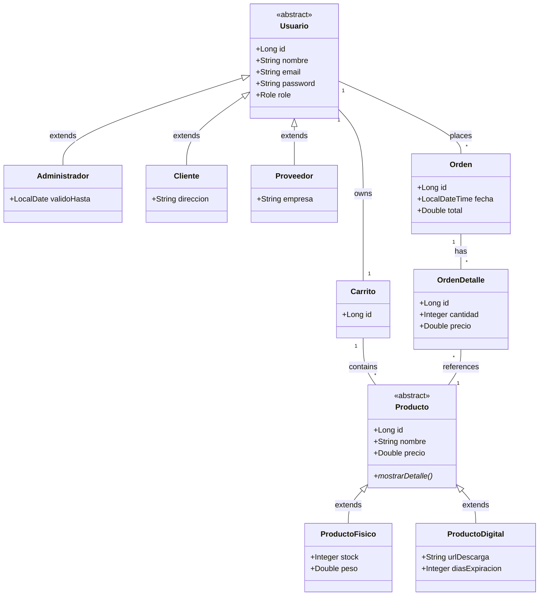

### Relaciones Detalladas

**1. Usuario ↔ Carrito** (OneToOne)
```java
// Usuario.java (no tiene referencia explícita al carrito)

// Carrito.java
@OneToOne
@JoinColumn(name = "usuario_id")
private Usuario usuario;
```
- ✅ 1 Usuario tiene 1 Carrito
- ✅ 1 Carrito pertenece a 1 Usuario

**2. Carrito ↔ Producto** (ManyToMany)
```java
@ManyToMany
@JoinTable(
    name = "carrito_productos",
    joinColumns = @JoinColumn(name = "carrito_id"),
    inverseJoinColumns = @JoinColumn(name = "producto_id")
)
private List<Producto> productos = new ArrayList<>();
```
- ✅ 1 Carrito contiene N Productos
- ✅ 1 Producto puede estar en N Carritos

**3. Usuario ↔ Orden** (OneToMany)
```java
@ManyToOne
@JoinColumn(name = "usuario_id")
private Usuario usuario;
```
- ✅ 1 Usuario puede tener N Órdenes
- ✅ 1 Orden pertenece a 1 Usuario

**4. Orden ↔ OrdenDetalle** (OneToMany)
```java
@OneToMany(mappedBy = "orden", cascade = CascadeType.ALL)
private List<OrdenDetalle> detalles = new ArrayList<>();
```
- ✅ 1 Orden tiene N Detalles
- ✅ 1 Detalle pertenece a 1 Orden

**5. OrdenDetalle ↔ Producto** (ManyToOne)
```java
@ManyToOne
@JoinColumn(name = "producto_id")
private Producto producto;
```
- ✅ 1 Detalle referencia a 1 Producto
- ✅ 1 Producto puede estar en N Detalles

---

## 🔐 Capa de Seguridad

### Spring Security
```java
@Configuration
@EnableWebSecurity
@EnableMethodSecurity
public class SecurityConfig {
    @Bean
    public SecurityFilterChain filterChain(HttpSecurity http) {
        // Configuración de endpoints públicos/privados
        // Integración de TokenAuthenticationFilter
    }
}
```

### Autorización con `@PreAuthorize`
```java
@PreAuthorize("hasRole('ADMIN')")
public ResponseEntity<List<Usuario>> listarUsuarios() { }

@PreAuthorize("hasRole('ADMIN') or @usuarioSecurity.isOwner(#id)")
public ResponseEntity<Usuario> obtenerUsuario(@PathVariable Long id) { }
```

---

## 🛠️ Tecnologías

### 1. Spring Boot para Java - Arquitectura y Funciones
Spring Boot es un framework sobre la plataforma Java que facilita la creación de aplicaciones stand-alone y preparadas para producción.
**Funciones Clave:**
- **Inversión de Control (IoC):** A través de su contenedor de Inyección de Dependencias, Spring "inyecta" los componentes (Beans) en tiempo de ejecución, por ejemplo el `@Autowired` entre `Controller`, `Service` y `Repository`.
- **Auto-Configuración:** Deduce automáticamente las configuraciones basándose en las dependencias presentes en el `pom.xml`, sin necesidad de archivos XML engorrosos.
- **Spring Data JPA:** Abstracción sobre la persistencia que reduce drásticamente el "boilerplate" al escribir queries directas con JDBC, mapeando anotaciones sobre entidades Java (`@Entity`) directamente a modelos relacionales.
- **Spring Security (Filtros):** Opera con una cadena de filtros (como visto en el log `FilterChainProxy`) validando los JSON Web Tokens (`TokenAuthenticationFilter`) antes de que la petición llegue al Controlador.
- **Servidor Web Embebido:** Contiene internamente a Tomcat/Undertow, obviando la configuración e instalación de servidores adicionales para el despliegue.

### 2. Integración de Base de Datos (MySQL) y Modelo de Datos
La aplicación se conecta a una base de datos relacional **MySQL** e implementa **Hibernate** como proveedor JPA para ORM (Object-Relational Mapping). 
- **Estrategia en `application.properties`:** Generalmente expone `spring.jpa.hibernate.ddl-auto=update` o `create-drop` en fase de desarrollo para recrear el esquema a base de las clases OOP marcadas como `@Entity`.
- **Relaciones implementadas:**
  - `OneToMany / ManyToOne`: Relaciona a múltiples `Ordenes` referenciadas a un único `Usuario`.
  - `ManyToMany`: Resuelto usando tablas pivote intermedias abstractas en SQL y mapeos transparentes en Java (e.g. `Carrito` contiene los `Producto`s).
  - Paginación e índices para acelerar búsquedas de acuerdo a atributos como `email`.

| Tecnología | Versión | Uso |
|-----------|---------|-----|
| Java | 21 | Lenguaje base |
| Spring Boot | 3.x | Framework |
| Spring Security | 6.x | Autenticación/Autorización |
| Spring Data JPA | 3.x | Persistencia |
| Hibernate | 6.x | ORM |
| MySQL | 8.x | Base de datos |
| Lombok | 1.18.x | Reducción de boilerplate |

---

## 🛡️ Fase 5 - Manejo de Excepciones Empresarial

La aplicación implementa una arquitectura robusta para el manejo de excepciones centralizado. Todas las excepciones de negocio heredan de una clase base común, lo que permite que el `GlobalExceptionHandler` (basado en `@RestControllerAdvice`) las intercepte y construya respuestas JSON estandarizadas en lugar de exponer los *stack traces* nativos de Java o Tomcat.

### Diagrama C4 (Component Layer)

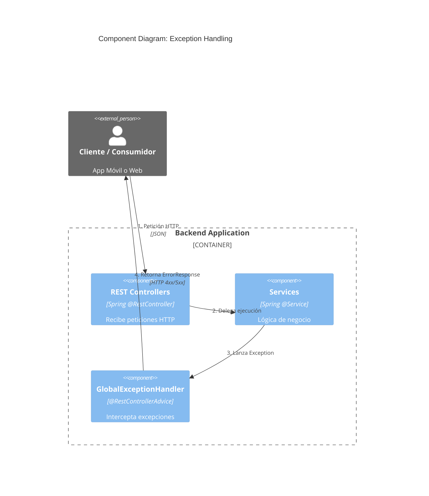

### Jerarquía de Excepciones (UML)

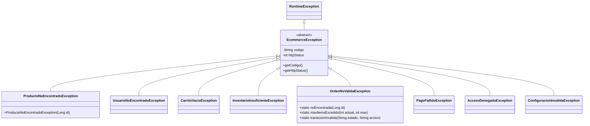

### Flujo de Error: Checkout Fallido (Diagrama de Secuencia)

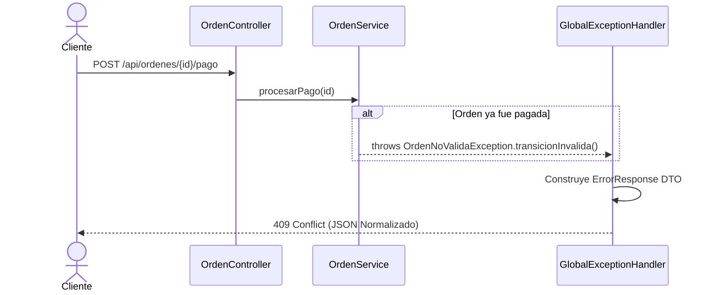

### JSON de Respuesta Estándar

Cualquier error en el sistema arrojará **siempre** esta estructura:

```json
{
  "timestamp": "2026-03-28T20:00:00.123",
  "codigo": "ORD_003",
  "mensaje": "Transición inválida: No se puede aplicar acción 'pago' en estado PAID",
  "path": "/api/ordenes/5/pago"
}
```

---

## 🧪 Fase 5 - Pruebas Unitarias (JUnit / Mockito)

El backend incluye una **Suite Completa de Pruebas Unitarias** para garantizar la integridad de la lógica de negocio sin depender de una base de datos real.

### Framework y Herramientas
- **JUnit 5 (Jupiter)**: Motor de pruebas.
- **Mockito**: Mocking de dependencias (`@Mock`, `@InjectMocks`).
- **Spring Boot Test**: Integración pura (`ReflectionTestUtils`), aunque la mayoría de los tests se ejecutan **sin levantar el contexto de Spring** para garantizar una ejecución ultra-rápida (aislamiento absoluto).

### Estrategia de Testing (Categorías)

1. **Pruebas de Modelos (Domain Logic):**
   - Validación de polimorfismo (`ProductoModelTest`).
   - Validación de constructores y lógicas internas.
   - Testeo de **Sobrecarga de Métodos** (Method Overloading) en el modelo (`CarritoModelTest`).

2. **Pruebas de Jerarquía de Excepciones:**
   - Verificación de herencia.
   - Validación de extracción de HTTP Status y mapeos internos de Código UUID (`EcommerceExceptionTest`).

3. **Pruebas de Servicios (Capa de Negocio):**
   - Simulación de repositorios y factores vía Mockito (`when().thenReturn()`).
   - Pruebas del **Ciclo de Orden Completo y Máquina de Estados** garantizando que sea a prueba de fallos (`OrdenServiceTest`).
   - Validaciones de *Security Context* interceptado artificialmente.

### Ejemplo de Bloque Unitario Independiente
```java
@ExtendWith(MockitoExtension.class)
class OrdenServiceTest {
    @Mock private OrdenRepository ordenRepository;
    @InjectMocks private OrdenService ordenService;

    @Test
    @DisplayName("procesarPago: estado PAID → OrdenNoValidaException (ORD_003)")
    void procesarPago_yaFuePagada() {
        // Arrange
        orden.setEstado(EstadoOrden.PAID);
        when(ordenRepository.findById(1L)).thenReturn(Optional.of(orden));

        // Act & Assert
        OrdenNoValidaException ex = assertThrows(OrdenNoValidaException.class, 
                () -> ordenService.procesarPago(1L, "Tarjeta", null));
                
        assertEquals("ORD_003", ex.getCodigo());
        assertEquals(409, ex.getHttpStatus());
    }
}
```

### Cómo Ejecutar las Pruebas

Para correr las 92 pruebas automatizadas desde la raíz del backend:

```bash
# Navegar al directorio del backend
cd backend

# Ejecutar framework Surefire (JUnit)
mvn clean test
```
*Si todo está correcto, se visualizará un mensaje similar a: `[INFO] Tests run: 92, Failures: 0, Errors: 0, Skipped: 0` y `BUILD SUCCESS`.*

---

## 📦 Gestión de Órdenes y Transición de Estados

El ciclo de vida de la orden está modelado bajo una estricta **Máquina de Estados**, dictada por las operaciones del dominio según el rol del usuario utilizando anotaciones de autorización (`@PreAuthorize("hasRole('...')")`).

### Relación Rol-Operación
1. **[CUSTOMER]**: 
   - Puede crear órdenes convirtiendo su Carrito -> `CREATED`. 
   - Puede elegir pago (procesando a `PAID` o `PAYMENT_PENDING` u `OUT_OF_STOCK`). 
   - Puede Cancelar su propia orden mientras esté en estado inicial. No tiene permiso ni vista para despachar.
2. **[ADMIN]**: 
   - No crea órdenes directas, pero supervisa el catálogo completo de operaciones de los usuarios. 
   - Único rol con autorización de `POST /api/shipments/despachar/{id}` -> `SHIPPED`. Solo aplicable para transacciones que ya estén garantizadas bajo `PAID`.
   - Único rol que aprueba el cierre logístico -> `DELIVERED`.
3. **[SUPPLIER]**: 
   - No tiene interacciones sobre las órdenes. Se orienta únicamente a inyección de inventario local o modificación del contenido del producto.

### Ciclo de Estados (`EstadoOrden.java`)
1. **`CREATED`**: Creado desde un carrito. Espera configuración de check-out en GUI.
2. **`PAYMENT_PENDING`**: Cuando el pago inició en el proveedor externo pero fue rechazado temporalmente.
3. **`PAID`**: Transacción de pago confirmada exitosa. Solo en este punto el **Stock** del `ProductoFisico` es descontado de la BD real.
4. **`OUT_OF_STOCK`**: Intentó pagar pero los `GestorInventario` respondieron false en `verificarStock()`. Queda en limbo de falla para recuperar.
5. **`CANCELLED`**: Anulada desde UI de Cliente/Admin.
6. **`SHIPPED`**: Entidad `Shipment` creada con empresa mensajera (`courier`) y número de guía de rastreo.
7. **`DELIVERED`**: Ciclo completado. El artículo fue entregado en la dirección del cliente.

---

## 🚀 Ejecución

```bash
# Compilar y ejecutar
cd backend
mvn spring-boot:run

# Acceder a la API
http://localhost:8080/api
```

---

## 🔍 Descripción detallada actualizada de la implementación de la arquitectura de backend para la solución eCommerce.

A continuación se expone el análisis profundo de la arquitectura, configuración, endpoints y persistencia de este backend eCommerce, modelado para un entorno empresarial.

### 1. Análisis Profundo del Backend (`Spring Boot`)

La arquitectura subyacente de este servidor Java se apoya íntegramente en las bondades de **Spring Boot**, promoviendo un desacoplamiento a través de la inyección de dependencias (`@Autowired` / Inversión de Control).

* **Estructura del Proyecto y Paquetes**: Organizado lógicamente por dominio o característica de negocio ("Feature-folder structure" combinada con de Capas).
  * `com.ecommerce.config`: Inicialización de beans estáticos, variables globales y datos quemados para testeo (`DataSeeder`).
  * `com.ecommerce.controller`: Frontera de la API. Exponen rutas `RESTful` empleando anotaciones como `@RestController` y `@RequestMapping`. Controlan el enrutamiento y deserialización JSON HTTP.
  * `com.ecommerce.service`: Core central del sistema. Aisla la lógica de negocio pura de las transacciones web. Operan con `@Service` y `@Transactional` para rollback en errores.
  * `com.ecommerce.repository`: Interfaces Spring Data JPA conectadas a MySQL que ahorran manipulación explícita del Driver JDBC.
  * `com.ecommerce.model` & `com.ecommerce.dto`: Los Modelos (*Entities*) mapean la base de datos. Los Data Transfer Objects (*DTOs*) sanitizan la exposición serializada para Jackson, eludiendo proxies perezosos (Lazy).
  * `com.ecommerce.security`: Cortafuegos inicial; provee `SecurityFilterChain`, `TokenAuthenticationFilter` para validación estricta de cada JWT cabecera antes del Controller.

* **Manejo de Errores y Validaciones**: Las validaciones se efectúan combinadamente; restricciones primarias a nivel de JPA (`@Column(nullable=false, unique=true)`) y en cascada por los *Services* (arrojando excepciones limpias tipo `RuntimeException` que Spring procesa nativamente, convirtiendo los códigos en `500` o `400`).

### 2. Persistencia de Datos (MySQL y JPA/Hibernate)

La capa transaccional se asienta en la tecnología Relacional **MySQL**, manipulada desde Java vía **Hibernate ORM**.

* **Mapeo ORM**: Objetos Java se proyectan en memoria tabular de MySQL empleando las especificaciones de JPA. Herencia avanzada (tipo `JOINED`) se aplica a los objetos `Usuario` y `Producto`.
* **Transacciones**: Controladas por `@Transactional`, permitiendo "Puntos de Control" o un Rollback atómico en dado caso que la Máquina de Estados de un *Checkout* se caiga (por ejemplo, al pagar sin red lógica).
* **Ausencia NoSQL**: Este sistema opera al **100% sobre tecnología relacional**, maximizando consistencia bajo el modelo ACID y evitando esquemas distribuidos ambiguos.
* **Ciclo de Vida Específico**:
  * **Usuarios**: Alta única por email. Modificación restringida y borrado en cascada (destruyéndose también su `Carrito` adjunto).
  * **Productos**: Inserción única por Proveedores/ADMIN. Su mutabilidad fundamental reside en el *Stock* del GestorFísico.
  * **Órdenes y Envíos**: Una orden muta internamente a través del enum `EstadoOrden`. Su registro final se archiva permanentemente vinculado al despachante (`Shipment`) e identificador logístico.

### 3. Diseño y Configuración MySQL

El motor base garantiza alta escalabilidad mediante patrones estandarizados en `application.properties`:

* **Configuración de Conexión y Datasource**: Mediante las propiedades `spring.datasource.url`, el controlador oficial `com.mysql.cj.jdbc.Driver` entabla puentes TCP/IP al clúster MySQL.
* **Pool de Conexiones (HikariCP)**: Integrado transparentemente por Spring Boot, el enjambre de conexiones pre-iniciadas y administradas por *HikariCP* asegura un tráfico eficiente frente a ráfagas de concurrentes HTTP sin instanciar sockets repetitivos.
* **Gestión Integridad y Consistencia**: La atomicidad de bases relacionales, acoplada al nivel de aislamiento nativo `READ_COMMITTED` de MySQL y los perfiles `@Lock` que Hibernate inyecta en background (para colisiones de stock), minimiza condiciones de carrera a nivel macro.

### 4. Diagrama ERD de la Base de Datos

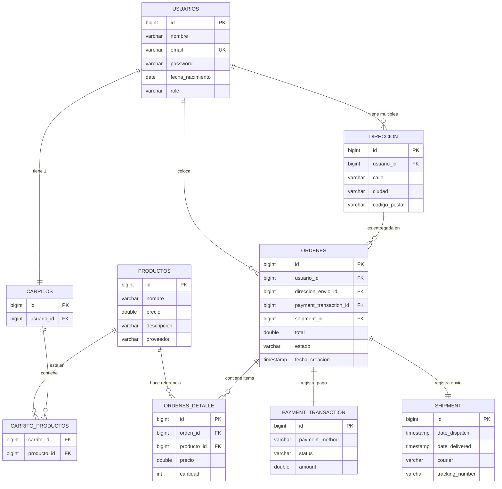

### 5. Diagrama de Clases Actualizado (Backend y DTOs)

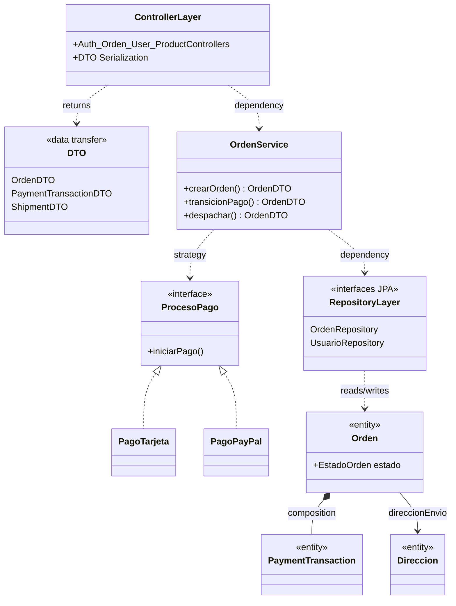

### 6. Arquitectura C4 Completa

* **Nivel 1 (Contexto)**:
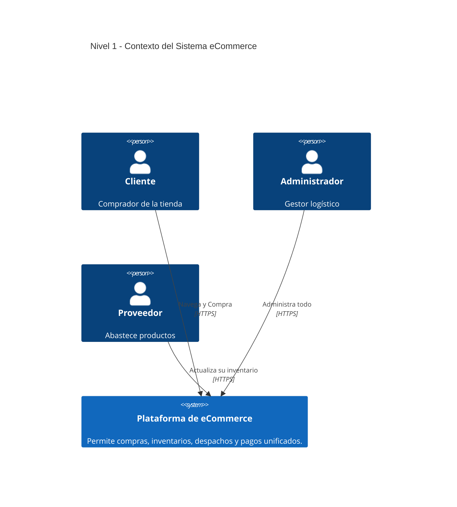

* **Nivel 2 (Contenedores)**:
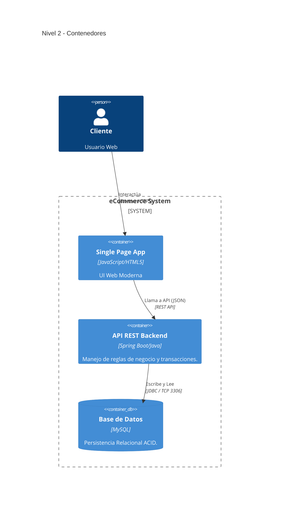

* **Nivel 3 (Componentes - API Backend)**:
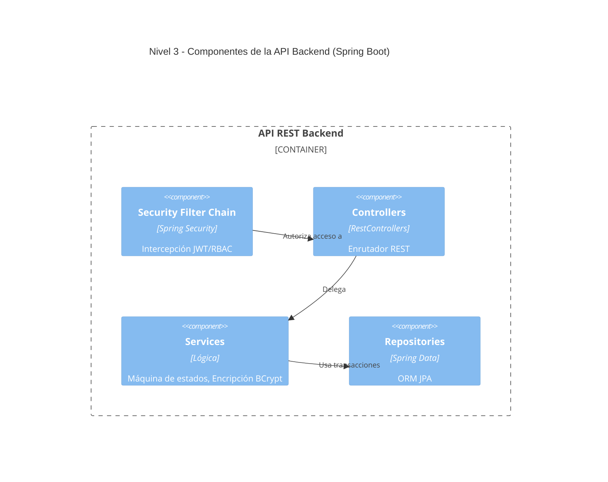
* **Nivel 4 (Código)**: *(Revisar sección 5. Modelo de Clases UML detallado arriba para implementaciones locales)*.

### Fase 4 - Patrones de Diseño Enterprise Estructurales y de Comportamiento

Para solidificar la integridad y escalabilidad de los servicios C4 declarados anteriormente, se implementó una serie de Patrones de Diseño formales orientados a transacciones seguras bajo concurrencia Spring Boot:

#### A. Patrón Singleton (Configuración Hilo-Seguro)
- **Objetivo**: Garantizar que exista una sola fuente de verdad en la memoria de la JVM para parámetros variables del negocio (como IVA, Stock Mínimo o Moneda).
- **Definición y Propósito**: En términos sencillos, el Singleton garantiza que una clase tenga una única instancia y proporciona un punto de acceso global a dicha instancia.
Su propósito principal es controlar el acceso a un recurso compartido. Imagina que tienes un objeto que gestiona la conexión a una base de datos o un sistema de registro de errores (logger); no tendría sentido tener diez instancias diferentes haciendo lo mismo, ya que podrían entrar en conflicto o consumir memoria innecesariamente.
- **Implementación**: La clase `ConfiguracionSistema.java` actúa como un Singleton central que gestiona parámetros core como la tasa de IVA, la moneda del sistema y el stock mínimo. En el código, se implementa mediante un constructor privado y el método getInstance() con Double-Checked Locking para garantizar que sea thread-safe en entornos de alta concurrencia.
- **Funcionamiento**: Emplea el algoritmo *Double-Checked Locking* en su constructor privado. Sus propiedades mutables (`AtomicReference`, `AtomicInteger`) previenen condiciones de carrera (*Race Conditions*) permitiendo que miles de hilos HTTP consulten la misma instancia sin bloqueos severos.

```java
@Component
public class ConfiguracionSistema {
    private static volatile ConfiguracionSistema instance;
    private final AtomicReference<Double> iva = new AtomicReference<>(0.16);
    
    private ConfiguracionSistema() {}

    public static ConfiguracionSistema getInstance() {
        if (instance == null) {
            synchronized (ConfiguracionSistema.class) {
                if (instance == null) { instance = new ConfiguracionSistema(); }
            }
        }
        return instance;
    }
}
```

#### B. Patrón Factory (Desacoplamiento Polimórfico)
- **Objetivo**: Abstraer la compleja ramificación de objetos que heredan de `Usuario` y `Producto`, salvaguardando el Principio de Responsabilidad Única (SRP) en los servicios de negocio.
- **Definición y Motivación**: El Factory Method (Método de Fábrica) es uno de los patrones de diseño creacionales más potentes y utilizados en la programación orientada a objetos. Su esencia es la delegación: en lugar de que una clase instancie objetos directamente, define una interfaz para crearlos, pero deja que las subclases decidan qué clase concreta instanciar. Según la definición clásica de Gamma et al. (1994), este patrón permite que una clase delegue la responsabilidad de la instanciación a sus subclases.
- **Implementación**: En el componente `FabricaEntidades.java`, el patrón se aplica para gestionar la diversidad del catálogo:

  - **Productos**: El sistema pide un "Producto". La fábrica evalúa si es un ProductoFisico (con lógica de envío) o un ProductoDigital (con lógica de descarga).

  - **Usuarios**: Dependiendo del registro, la fábrica crea un Cliente, Administrador o Proveedor. El sistema de autenticación trata a todos como Usuario, pero la fábrica inyecta el comportamiento específico de cada rol.
- **Funcionamiento**: En lugar de ensuciar el `ProductoService` con condicionales `new ProductoFisico()` o `new ProductoDigital()`, la Fábrica recibe el rol o tipo y genera la concreción adecuada. Esto centraliza la inicialización de estado per-entidad.

```java
@Component
public class FabricaEntidades {
    public Producto crearProductoSegunTipo(String tipo) {
        if (tipo == null) throw new IllegalArgumentException("Tipo no puede ser null");
        switch (tipo.toLowerCase()) {
            case "fisico": return new ProductoFisico();
            case "digital": return new ProductoDigital();
            default: throw new IllegalArgumentException("Tipo de producto desconocido");
        }
    }
}
```

#### C. Patrón Observer (Event-Driven Architecture)
- **Objetivo**: Desacoplar la rígida tubería de `OrdenService` aislando sub-procesos lentos (como notificaciones telefónicas o rebajas de almacén) del hilo principal del pago (Checkout), mejorando radicalmente la latencia percibida por el usuario.
- **Implementación**: `ApplicationEventPublisher` y clases bajo `com.ecommerce.observer.*`.
- **Funcionamiento**: 
  - **Dominio de Eventos (Publishers)**: En cada transición de la Máquina de Estados (ej. `PRE_PAID` a `PAID`), se detona un suceso determinístico (`eventPublisher.publishEvent(new OrdenPagadaEvent(this, orden))`).
  - **Receptores Pasivos (Listeners)**:
    1. `InventarioObserver`: Escucha el ticket pagado y deduce formalmente de MySQL. Si detecta desabasto, lanza recursivamente otro evento: `StockBajoEvent`.
    2. `NotificacionObserver`: Actúa puramente notificando correos/SMS al recibir el suceso de "Despacho" o "Entrega".
    3. `AuditoriaObserver`: Operativo mediante la anotación de concurrencia nativa `@Async` (delega un sub-hilo paralelo logístico), garantizando que el log de seguridad no interrumpa el `200 OK` de respuesta final al frontend.

```java
@Component
public class InventarioObserver {
    @EventListener
    public void onOrdenPagada(OrdenPagadaEvent event) {
        // Deduzca stock delegadamente
        for (OrdenDetalle detalle : event.getOrden().getDetalles()) {
           gestor.actualizarStock(detalle.getProducto(), -detalle.getCantidad());
        }
    }
}

@Component
public class AuditoriaObserver {
    @Async
    @EventListener
    public void auditarTransicionPagada(OrdenPagadaEvent event) {
        System.out.println("[AUDIT] Pago procesado: ID " + event.getOrden().getId());
    }
}
```

### Fase 4 - Ciclo de Vida de una Orden (Secuencia Completa)

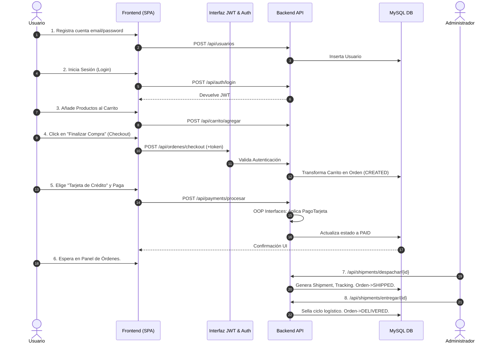

### Fase 4 - Análisis y Documentación de Postman (Flujos Automatizados)

La colección Postman completa se encuentra en `backend/ECommerce_Collection.json`. Puede importarse directamente desde Postman con **File → Import**. Cubre **12 grupos** con más de **45 requests** que prueban todos los controladores REST disponibles en la implementación.

#### Variables de Colección

| Variable | Descripción | Valor por defecto |
|---|---|---|
| `baseUrl` | URL base del backend | `http://localhost:8080/api` |
| `tokenAdmin` | JWT del ADMIN (auto-inyectado) | *(vacío — se llena al hacer Login Admin)* |
| `tokenCustomer` | JWT del CUSTOMER (auto-inyectado) | *(vacío — se llena al hacer Login Customer)* |
| `tokenSupplier` | JWT del SUPPLIER (auto-inyectado) | *(vacío)* |
| `productoId` | ID de producto activo en pruebas | `1` |
| `ordenId` | ID de orden activa en pruebas | `1` |
| `direccionId` | ID de dirección activa en pruebas | `1` |
| `usuarioId` | ID de usuario objetivo (pruebas Admin) | `2` |

> **Flujo recomendado**: Ejecutar primero **Login Admin** y **Login Customer** para poblar los tokens. Los scripts `Tests` de cada login los inyectan automáticamente en las variables de colección.

#### Grupos de Endpoints

| # | Grupo | Endpoints | Roles Cubiertos |
|---|---|---|---|
| 1 | **Autenticación** | Login Admin, Login Customer, Login Supplier, Login Inválido (401) | Público |
| 2 | **Usuarios** | Registrar Cliente/Proveedor/Admin, Listar, Obtener por ID, Actualizar, Eliminar, Acceso denegado (403) | Público / ADMIN |
| 3 | **Productos** | Listar (público), Obtener por ID, Crear Físico, Crear Digital, Actualizar, Eliminar | Público / ADMIN / SUPPLIER |
| 4 | **Carrito** | Obtener carrito, Agregar producto, Eliminar 1 unidad, Eliminar completo (trash), Vaciar carrito | CUSTOMER |
| 5 | **Órdenes** | Checkout con/sin dirección, Listar (ADMIN/CUSTOMER), Listar por usuario, Marcar pendiente, Cancelar | CUSTOMER / ADMIN |
| 6 | **Pagos** | Procesar con Tarjeta, PayPal y Transferencia | CUSTOMER / ADMIN |
| 7 | **Envíos** | Despachar, Marcar entregada, Intento sin permiso (403) | ADMIN |
| 8 | **Direcciones** | Crear propia, Listar mis direcciones, Obtener por ID, Listar todas (ADMIN), Listar por usuario, Actualizar, Crear para otro usuario (ADMIN), Eliminar | CUSTOMER / ADMIN / SUPPLIER |
| 9 | **Configuración** | GET/PUT Config JWT, GET/PUT Config Sistema, GET Config Pública (sin auth) | Público / ADMIN |
| 10 | **Chatbot IA** | Enviar mensaje, Pregunta sobre órdenes, Pregunta sobre pagos, Limpiar historial | CUSTOMER |
| 11 | **Notificaciones** | Obtener pendientes (ADMIN), ACK (marcar leídas), Intento sin permiso (403) | ADMIN |
| 12 | **Flujo E2E Completo** | Login → Ver Productos → Agregar al Carrito → Checkout → Pago → Despacho → Entrega | CUSTOMER + ADMIN |

#### Scripts de Prueba Automatizados

Cada request incluye un bloque `Tests` en JavaScript de Postman con las siguientes validaciones:

```javascript
// Ejemplo: Login Admin — captura token automáticamente
var json = pm.response.json();
if (json.token) { pm.collectionVariables.set('tokenAdmin', json.token); }
pm.test('Status 200', () => pm.response.to.have.status(200));
pm.test('Token recibido', () => pm.expect(json.token).to.be.a('string'));

// Ejemplo: Checkout — guarda el ID de la orden para usar en Pago y Envío
var json = pm.response.json();
if (json.id) { pm.collectionVariables.set('ordenId', json.id.toString()); }
pm.test('Estado CREATED', () => pm.expect(json.estado).to.eql('CREATED'));

// Ejemplo: Pago — valida transición de estado correcta
pm.test('Estado válido', () => {
  pm.expect(['PAID','OUT_OF_STOCK','PAYMENT_PENDING']).to.include(pm.response.json().estado);
});
```

#### Casos de Seguridad Incluidos

| Escenario | Endpoint | Código Esperado |
|---|---|---|
| Login con credenciales incorrectas | `POST /auth/login` | `401` |
| Listar usuarios sin token | `GET /usuarios` | `401` / `403` |
| Despachar orden como CUSTOMER | `POST /shipments/despachar/{id}` | `403` |
| Ver notificaciones como CUSTOMER | `GET /notificaciones/pendientes` | `403` |

Para ejecutar todos los casos en lote, utiliza **Collection Runner** en Postman indicando el orden de los grupos del 1 al 12. El grupo 12 (E2E) reproduce el ciclo de vida completo de una compra de principio a fin.

### Fase 4 - Especificación Reconstruida OpenAPI / Swagger

Referencia estática OpenAPI `3.0.0` extraída desde la arquitectura de controladores Spring.
```yaml
openapi: 3.0.0
info:
  title: E-Commerce API
  version: 3.0.0
paths:
  /api/auth/login:
    post:
      summary: Retorna JWT Bearer Token
      requestBody:
        content:
          application/json:
            schema:
              type: object
              properties:
                email: { type: string }
                password: { type: string }
      responses:
        '200': { description: Login exitoso }
  /api/usuarios:
    get:
      summary: CRUD - Obtiene todos los usuarios (ADMIN Only)
      security: [{ bearerAuth: [] }]
      responses: { '200': { description: Lista Usuarios Válida } }
  /api/ordenes/checkout:
    post:
      summary: Convierte los items actuales en el carrito a una nueva Orden en estado CREATED.
      security: [{ bearerAuth: [] }]
      responses: { '200': { description: Objeto OrdenDTO anidado con ShipmentDTO vacío. } }
  /api/payments/procesar:
    post:
      summary: Procesamiento transaccional de estados.
      requestBody:
        content:
          application/json:
            example: {"ordenId": 1, "metodoPago": "Tarjeta"}
      responses:
        '200': { description: Orden transitada exitosamente a PAID y stock mermado en MySQL. }
components:
  securitySchemes:
    bearerAuth:
      type: http
      scheme: bearer
      bearerFormat: JWT
```

### Fase 3 - Interfaces de Pago

El patrón *Strategy / Factory* se manifiesta bajo el paquete `payment`.
* `ProcesoPago` es la super-interface central definiendo firmas lógicas: `iniciarPago(Orden)`, `verificarPago(Orden)`, `confirmarPago(Orden)`.
* Sus extensiones concretas (`PagoTarjeta`, `PagoPayPal`, `PagoTransferencia`) proveen el determinismo algorítmico individualizado y validan polimórficamente el método especificado por la carga útil en frontend (Ej: procesar API bancaria frente a API PayPal remota antes de resolver exitoso el bloque a `PAID`).

**Interface `PaymentTransactionRepository`**
```java
package com.ecommerce.repository;

import com.ecommerce.model.PaymentTransaction;
import org.springframework.data.jpa.repository.JpaRepository;
import org.springframework.stereotype.Repository;

@Repository
public interface PaymentTransactionRepository extends JpaRepository<PaymentTransaction, Long> {
}
```

**Superinterface `procesoPagoFactory`**
```java
/**
 * Factory para obtener la estrategia de pago correcta.
 */
@Service
public class ProcesoPagoFactory {

    @Autowired
    @Qualifier("PagoTarjeta")
    private ProcesoPago pagoTarjeta;

    @Autowired
    @Qualifier("PagoPayPal")
    private ProcesoPago pagoPayPal;

    @Autowired
    @Qualifier("PagoTransferencia")
    private ProcesoPago pagoTransferencia;

    public ProcesoPago obtenerMetodo(String method) {
        if (method == null)
            return pagoTarjeta;
        switch (method.toLowerCase()) {
            case "paypal":
                return pagoPayPal;
            case "transferencia":
                return pagoTransferencia;
            case "tarjeta":
            default:
                return pagoTarjeta;
        }
    }
}
```

**Proceso de pago completo `procesarPago`**
```java
    /**
     * FASE 2: Procesar Pago y Verificar Stock
     */
    @Transactional
    public OrdenDTO procesarPago(Long ordenId, String metodoPago) {
        Orden orden = ordenRepository.findById(ordenId)
                .orElseThrow(() -> new RuntimeException("Orden no encontrada"));

        // Validaciones Máquina de Estados
        if (orden.getEstado() == EstadoOrden.PAID || orden.getEstado() == EstadoOrden.SHIPPED
                || orden.getEstado() == EstadoOrden.DELIVERED) {
            throw new RuntimeException("La orden ya fue pagada o procesada.");
        }
        if (orden.getEstado() == EstadoOrden.CANCELLED) {
            throw new RuntimeException("La orden está cancelada.");
        }

        // 1. Verificar Stock Múltiple (OOP Abstraction)
        boolean hasStock = true;
        for (OrdenDetalle detalle : orden.getDetalles()) {
            GestorInventario gestor = inventarioFactory.obtenerGestor(detalle.getProducto());
            if (!gestor.verificarStock(detalle.getProducto(), detalle.getCantidad())) {
                hasStock = false;
                break;
            }
        }

        if (!hasStock) {
            orden.setEstado(EstadoOrden.OUT_OF_STOCK);
            return toDTO(ordenRepository.save(orden));
        }

        // Transición a Payment Pending si hay stock
        orden.setEstado(EstadoOrden.PAYMENT_PENDING);

        // 2. Procesar Pago (OOP Interface)
        ProcesoPago procesoPago = pagoFactory.obtenerMetodo(metodoPago);
        procesoPago.iniciarPago(orden);

        boolean pagoExitoso = procesoPago.verificarPago(orden);

        if (pagoExitoso) {
            PaymentTransaction trx = procesoPago.confirmarPago(orden, orden.getTotal());
            if (trx != null) {
                trx = paymentTransactionRepository.save(trx);
                orden.setPaymentTransaction(trx);
            }
            orden.setEstado(EstadoOrden.PAID);

            // 3. Descontar Stock definitivo porque ya se pagó
            for (OrdenDetalle detalle : orden.getDetalles()) {
                GestorInventario gestor = inventarioFactory.obtenerGestor(detalle.getProducto());
                gestor.actualizarStock(detalle.getProducto(), -detalle.getCantidad());
            }
        } else {
            // Se queda en pending si falla (el prompt indica: "Si un intento de pago falla,
            // el estado permanece PAYMENT_PENDING")
            orden.setEstado(EstadoOrden.PAYMENT_PENDING);
        }

        return toDTO(ordenRepository.save(orden));
    }
```

### Fase 4 - Seguridad y Manejo de Sesiones Avanzadas

El motor Java subyacente implementa autenticación completamente **Stateless**.
* **Protección Criptográfica**: Las contraseñas se ofuscan en la base de datos tras una vía de escape unidireccional por `BCryptPasswordEncoder`, blindando frente a exfiltraciones relacionales.
* **Autorización Granular (RBAC)**: En vez de un filtro global que dependa de URL Pathing pre-configurado en contexto clásico, el servidor utiliza resolución a nivel de método: `@PreAuthorize("hasRole('ADMIN') or @usuarioSecurity.isOwner(#usuarioId)")`. Esto deniega agresivamente la intrusión de escalada horizontal en tiempo real.
* **Manejo de Sesiones**: En oposición a las interfaces `JSESSIONID` ligadas a memoria física servidor, cada `TokenAuthenticationFilter` intercepta y decodifica el JSON Web Token de la petición REST validando su caducidad, firma HMAC encubierta, e inyectándolo hacia `SecurityContextHolder` temporalmente durante el hilo HTTP particular.

---

## 📚 Licencia

BIU License - Proyecto Académico - Módulo Object-Oriented Programming.

---

## 🔄 Fase 3 – Nuevas Funcionalidades

### Extensión de la Entidad `Producto`

#### Nuevos Atributos Obligatorios
```java
public abstract class Producto {
    // ... campos existentes ...
    @Column(length = 250)
    private String descripcion;      // Máx. 250 caracteres

    @Column(length = 150)
    private String proveedor;        // Nombre/empresa del proveedor. Solo ADMIN puede asignar.

    @OneToMany(mappedBy = "producto", cascade = CascadeType.ALL, orphanRemoval = true)
    private List<ProductoImagen> imagenes = new ArrayList<>();
}
```

#### Entidad `ProductoImagen`
```java
@Entity
@Table(name = "producto_imagenes")
public class ProductoImagen {
    @Id @GeneratedValue
    private Long id;

    @Column(nullable = false)
    private String imagenUrl;   // URL de la imagen

    @Column(nullable = false)
    private Boolean isDefault;  // Una sola imagen por defecto por producto

    @ManyToOne(fetch = FetchType.LAZY)
    @JoinColumn(name = "producto_id")
    private Producto producto;
}
```

**Reglas de negocio de imágenes:**
- Mínimo una imagen por producto
- Exactamente una imagen marcada como `isDefault = true`
- Solo ADMIN puede crear productos; ADMIN + SUPPLIER pueden editar
- SUPPLIER no puede ver ni modificar el campo `proveedor`

---

### Nueva Entidad `Direccion`

```java
@Entity
@Table(name = "direcciones")
public class Direccion {
    private Long id;
    private Boolean preferida;         // Única dirección preferida por usuario
    private String alias;              // Etiqueta (Casa, Trabajo…)
    private String calle;              // Máx. 25 caracteres
    private String numeroExterior;     // Máx. 10 caracteres
    private String numeroInterior;     // Máx. 10 caracteres (opcional)
    private String referencia;         // Máx. 35 caracteres (opcional)
    private String colonia;            // Máx. 40 caracteres
    private String municipio;          // Máx. 45 caracteres
    private String estado;             // Máx. 25 caracteres
    private String codigoPostal;       // Exactamente 5 dígitos

    @ElementCollection
    private List<String> telefonos;    // Mín. 1 teléfono, formato: 10 dígitos

    @ManyToOne(fetch = FetchType.LAZY)
    @JoinColumn(name = "usuario_id")
    private Usuario usuario;
}
```

**Reglas de negocio de direcciones:**
- Mínimo 1 dirección permitida por usuario; máximo 5
- Solo 1 dirección `preferida` por usuario; al marcar una nueva, la anterior se desmarca automáticamente
- Cada teléfono debe tener exactamente 10 dígitos numéricos
- ADMIN puede gestionar direcciones de cualquier usuario
- CUSTOMER puede crear/editar/eliminar sus propias direcciones
- SUPPLIER puede crear/editar sus propias direcciones, pero NO eliminar

---

- `GestorInventario`: Interfaz para la gestión de inventario físico vs. digital.
- `ProcesoPago`: Interfaz para múltiples proveedores de pago (Tarjeta, PayPal, Transferenci a).
- **Comprobación de seguridad**: Implementada mediante Spring Security (`@PreAuthorize`).
- **Adiciones de la Fase 3**: Gestión del ciclo de vida de pedidos (`EstadoOrden`), Checkout unificado, Transacciones de pago y Envíos.

## Resumen de los Endpoints de la API

| Método | Punto de conexión | Acceso | Descripción |
| :--- | :--- | :--- | :--- |
| **POST** | `/api/auth/register` | Público | Registrar nuevo usuario. |
| **POST** | `/api/auth/login` | Público | Autenticar usuario y obtener token. |
| **GET** | `/api/productos` | Público | Listar productos disponibles. | 
| **POST** | `/api/productos` | Administrador | Crear un nuevo producto. |
| **GET** | `/api/direcciones/mis-direcciones` | Autenticado | Listar direcciones de usuario. |
| **POST** | `/api/ordenes/checkout` | Cliente | Convertir carrito en pedido (estado CREATED). |
| **POST** | `/api/payments/procesar` | Cliente | Procesar pago (PAID / OUT_OF_STOCK). |
| **POST** | `/api/shipments/despachar/{id}`| Administrador | Enviar pedido (SHIPPED). |
| **POST** | `/api/shipments/entregar/{id}` | Administrador | Marcar entrega (DELIVERED). |

Para obtener una lista completa de los puntos finales, importe la colección de Postman proporcionada (..\backend\ECommerce_Collection.json) o revise los controladores subyacentes.

### Nuevos Endpoints API (Fase 3)

#### Direcciones (`/api/direcciones`)
| Método | Endpoint | Rol Requerido | Descripción |
|--------|----------|---------------|-------------|
| `POST` | `/api/direcciones` | ADMIN, CUSTOMER, SUPPLIER | Crear dirección propia |
| `PUT` | `/api/direcciones/{id}` | ADMIN, CUSTOMER, SUPPLIER | Actualizar dirección |
| `GET` | `/api/direcciones/mis-direcciones` | ADMIN, CUSTOMER, SUPPLIER | Listar mis direcciones |
| `GET` | `/api/direcciones/{id}` | ADMIN, CUSTOMER, SUPPLIER | Obtener dirección por ID |
| `GET` | `/api/direcciones/usuario/{usuarioId}` | ADMIN, CUSTOMER, SUPPLIER | Listar por usuario |
| `GET` | `/api/direcciones` | ADMIN | Todas las direcciones |
| `DELETE` | `/api/direcciones/{id}` | ADMIN, CUSTOMER | Eliminar dirección |
| `POST` | `/api/direcciones/usuario/{usuarioId}` | ADMIN | Crear para otro usuario |

#### Productos (actualizados)
| Método | Endpoint | Campos Nuevos |
|--------|----------|---------------|
| `POST` | `/api/productos` | `descripcion`, `proveedor`, `imagenesUrls[]`, `defaultImageIndex` |
| `PUT` | `/api/productos/{id}` | `descripcion`, `imagenesUrls[]`, `defaultImageIndex` (proveedor: solo ADMIN) |
| `GET` | `/api/productos` | Respuesta incluye `imagenes[]`, `descripcion`, `proveedor` |

---

### `UsuarioService` – Método Añadido

```java
/**
 * Busca un usuario por ID; lanza excepción si no existe.
 * Usado por DireccionController para operaciones sobre destinatarios específicos.
 */
public Usuario buscarPorId(Long id) {
    return usuarioRepository.findById(id)
            .orElseThrow(() -> new RuntimeException("Usuario no encontrado con id: " + id));
}
```

### 7. Modelo Entidad-Relación (ERD) Parcial.
Destaca la inyección segura de la Foreign Key en ORDENES sin romper tablas previamente acopladas.

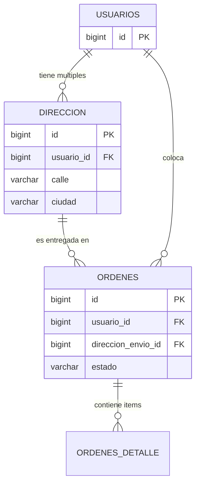

### 8. Diagrama de Clases (Inyección de Dependencia para Direcciones).
Muestra cómo `OrdenService` opera el nuevo Repositorio dentro del contenedor transaccional.

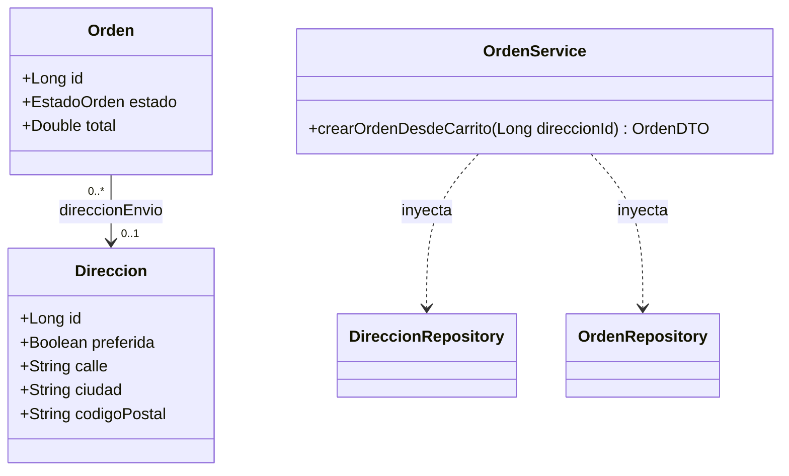

### 9. Diagrama de Secuencia: Flujo de Checkout con Asignación de Dirección.
Este esquema detalla cómo el sistema orquesta la creación de una orden y la asocia a una dirección estática sin romper relaciones existentes:

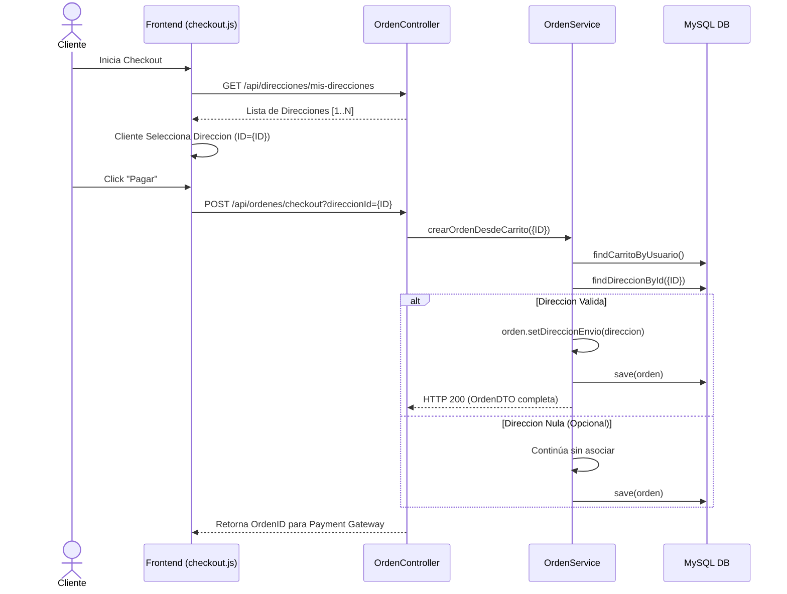
