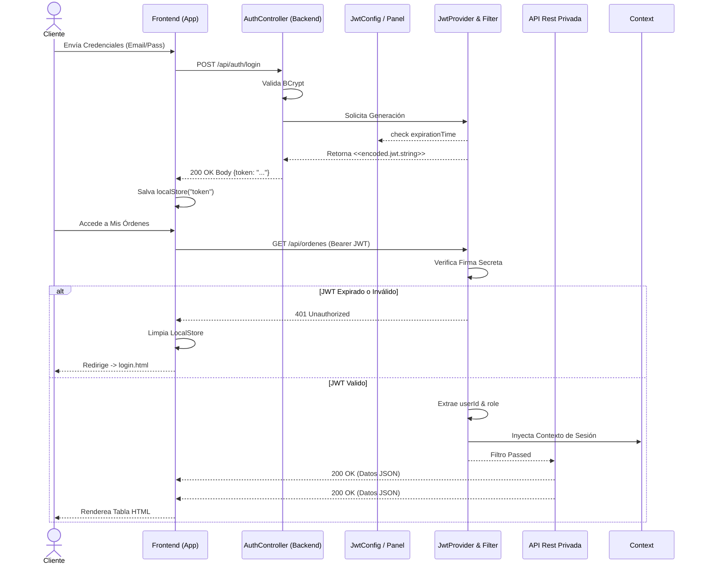

# E-Commerce Frontend v4.0

## 🎯 Propósito del Proyecto

Este frontend forma parte de una solución completa de **E-Commerce** que permite gestionar productos, carrito de compras, órdenes y usuarios con control de acceso basado en roles (RBAC).

- Autor: Ramón Bolívar Cuevas Escobar

- Módulo: Programming the Internet (CSE6042)

- Profesor: Dr. Alexander Guevara

### Problema que Resuelve
- **Gestión de inventario** para administradores y proveedores
- **Experiencia de compra** fluida para clientes
- **Control de acceso** granular según el tipo de usuario
- **Administración centralizada** de usuarios, productos, órdenes y envíos

### Características de la Fase 3

### Proceso de compra y pagos
- **`checkout.html`**: Secuencia de pago completa con selección de dirección.
- **Validación dinámica**: Validación de formulario en tiempo real aplicada a la entrada de datos de tarjeta de crédito (datos simulados).
- **Procesamiento de pagos**: Sustituye el proceso directo del carrito al pedido por una confirmación paso a paso.

### Gestión de órdenes (Cliente y administrador)
- **`ordenes.html`**: Nueva página para listar las órdenes y su estado actual.
- **Indicadores de estado**: Indicadores visuales para `CREATED`, `PAYMENT_PENDING`, `PAID`, `OUT_OF_STOCK`, `CANCELLED`, `SHIPPED`, `DELIVERED`.
- **Modalidad de detalles de la orden**: Vista detallada de los productos, las transacciones de pago y la información de envío que contiene un pedido. 
- **Modalidad de Despacho de Administrador**: Formularios con validación dinámica para registrar la empresa de mensajería y el número de la guía para seguimiento.

### Visibilidad de Inventario
- **`productos.html`**: La cuadrícula de productos ahora muestra opcionalmente el `Stock` en tiempo real para los roles de Administrador/Proveedor.

---

## Detalles Técnicos
- ✅ Autenticación y gestión de sesiones
- ✅ CRUD de productos (físicos y digitales)
- ✅ Carrito de compras personalizado
- ✅ Historial de órdenes
- ✅ Gestión de usuarios (ADMIN únicamente)
- ✅ Menú dinámico según rol del usuario

### Tipos de Usuarios
|       Rol     | Permisos                                                                  |
|---------------|---------------------------------------------------------------------------|
| **ADMIN**     | Gestión completa: productos, usuarios, órdenes, envíos                            |
| **SUPPLIER**  | Edición de productos, visualización de órdenes                            |
| **CUSTOMER**  | Compra de productos, gestión de carrito, proceso de pago, cancelación de órdenes, visualización de propias órdenes |

---

## 🏗️ Arquitectura del Frontend

### Modelo SPA (Single Page Application)
El frontend está construido como una **SPA parcial** usando HTML5, CSS3, y JavaScript ES6+ modular:

- **Páginas independientes**: Cada vista es un archivo HTML separado
- **Módulos JavaScript**: Lógica organizada en módulos ES6 (`import`/`export`)
- **Estado compartido**: `localStorage` almacena sesión del usuario
- **Navegación dinámica**: Menú se adapta según rol del usuario autenticado

### Comunicación con API REST
```javascript
// api.js - Cliente HTTP centralizado
const Api = {
    async get(endpoint) { /* ... */ },
    async post(endpoint, data) { /* ... */ },
    async put(endpoint, data) { /* ... */ },
    async delete(endpoint) { /* ... */ }
};
```

**Headers automáticos:**
- `Content-Type: application/json`
- `Authorization: Bearer {token}` (si el usuario está autenticado)

**Manejo de errores:**
- Redirección automática a `/login.html` en errores 401/403
- Notificaciones visuales en operaciones CRUD

### Control de Estado
**Autenticación (localStorage):**
```json
{
  "user": {
    "id": 1,
    "nombre": "Admin User",
    "email": "admin@example.com",
    "role": "ADMIN"
  },
  "token": "mock-jwt-token-1"
}
```

### Manejo de Autenticación
```javascript
// auth.js
const Auth = {
    login(user, token) { /* Guardar en localStorage */ },
    logout() { /* Limpiar localStorage */ },
    isAuthenticated() { /* Verificar token */ },
    getCurrentUser() { /* Obtener usuario actual */ }
};
```

**Flujo de autenticación:**
1. Usuario envía credenciales a `/auth/login`
2. Backend valida y retorna `{id, nombre, role, token}`
3. Frontend almacena en `localStorage`
4. Todas las peticiones incluyen `Authorization: Bearer {token}`
5. TokenAuthenticationFilter valida en backend
6. Si token inválido → 401 → Redirect a login

---

## 🎨 Diseño de Interfaces

### HTML5 Semántico
Uso de etiquetas semánticas para mejor accesibilidad y SEO:
```html
<nav>   <!-- Navegación principal -->
<main>  <!-- Contenido principal -->
<header><!-- Encabezados de sección -->
<form>  <!-- Formularios interactivos -->
<table> <!-- Tablas de datos -->
```

### CSS3 + Tailwind CSS
**Framework**: Tailwind CSS v3 (utility-first)
**Compilación**: `npx tailwindcss -i ./css/styles.css -o ./css/output.css --watch`

**Clases comunes:**
- Layout: `flex`, `grid`, `container`, `mx-auto`
- Spacing: `px-6`, `py-4`, `gap-4`
- Colors: `bg-blue-600`, `text-gray-700`, `hover:bg-blue-700`
- Shadow: `shadow-md`, `shadow-xl`
- Transitions: `transition`, `duration-300`

### Responsividad
Diseño Mobile-First con breakpoints de Tailwind:
```css
sm:  /* 640px  - Tablets           */
md:  /* 768px  - Tablets landscape */
lg:  /* 1024px - Desktop           */
xl:  /* 1280px - Desktop grande    */
```

Ejemplo:
```html
<div class="flex flex-col md:flex-row gap-4">
    <!-- En móvil: columna | En desktop: fila -->
</div>
```

### Interactividad
**Modales dinámicos:**
```javascript
UI.toggleModal('modalProducto', true);  // Abrir
UI.toggleModal('modalProducto', false); // Cerrar
```

**Notificaciones:**
```javascript
UI.showNotification('Guardado exitosamente', 'success');
UI.showNotification('Error al guardar', 'error');
```

---

## 📋 Validador de Formularios Dinámico

### Caso de Uso: Registro de Nuevo Usuario

**Archivo**: `usuarios.html` + `usuarios.js`

#### Campos Validados
|       Campo       |    Tipo   |             Validación            |  Requerido  |
|-------------------|-----------|-----------------------------------|-------------|
| Nombre            | text      | No vacío                          | Sí          |
| Email             | email     | Formato email válido              | Sí          |
| Contraseña        | password  | No vacío (solo en creación)       | Condicional |
| Rol               | select    | Uno de: ADMIN, SUPPLIER, CUSTOMER | Sí          |
| Fecha Nacimiento  | date      | Formato ISO (YYYY-MM-DD)          | No          |

#### Validaciones por Campo

**1. Nombre**
```javascript
<input type="text" id="nombre" required>
```
- ✅ HTML5 `required` attribute
- ❌ Vacío → "Por favor, rellene este campo"

**2. Email**
```javascript
<input type="email" id="email" required>
```
- ✅ HTML5 email validation
- ❌ Formato inválido → "Incluya un '@' en la dirección"
- ❌ Vacío → "Por favor, rellene este campo"

**3. Contraseña**
```javascript
// En creación:
passwordField.setAttribute('required', 'required');

// En edición:
passwordField.removeAttribute('required');
if (!password.value) {
    delete datosUsuario.password; // No enviar si está vacío
}
```
- ✅ Requerida solo al crear
- ✅ Opcional al editar (mantiene la existente si vacío)

**4. Rol**
```javascript
<select id="role" required>
    <option value="">Seleccionar rol...</option>
    <option value="ADMIN">Administrador</option>
    <option value="SUPPLIER">Proveedor</option>
    <option value="CUSTOMER">Cliente</option>
</select>
```
- ✅ Debe seleccionar un valor
- ❌ Valor vacío → "Seleccione un elemento de la lista"

**5. Fecha de Nacimiento** (Opcional)
```javascript
<input type="date" id="fechaNacimiento">
const fecha = document.getElementById('fechaNacimiento').value || null;
```
- ✅ Formato ISO automático
- ✅ Envía `null` si no se proporciona

#### Validación en Submit
```javascript
formUsuario.addEventListener('submit', async (e) => {
    e.preventDefault(); // Evitar recarga de página
    
    // HTML5 validations se ejecutan automáticamente antes de este punto
    
    const datosUsuario = {
        nombre: document.getElementById('nombre').value,
        email: document.getElementById('email').value,
        password: document.getElementById('password').value,
        role: document.getElementById('role').value,
        fechaNacimiento: document.getElementById('fechaNacimiento').value || null
    };
    
    // Validación adicional: eliminar contraseña vacía en edición
    if (usuarioId && !datosUsuario.password) {
        delete datosUsuario.password;
    }
    
    try {
        if (usuarioId) {
            await Api.put(`/usuarios/${usuarioId}`, datosUsuario);
        } else {
            await Api.post('/usuarios/admin', datosUsuario);
        }
        UI.showNotification('Usuario guardado', 'success');
    } catch (error) {
        UI.showNotification('Error: ' + error.message, 'error');
    }
});
```

#### Mensajes de Error (UX)
**Validaciones HTML5 (nativas del navegador):**
- "Por favor, rellene este campo"
- "Incluya un '@' en la dirección de correo electrónico"
- "Seleccione un elemento de la lista"

**Validaciones del servidor (desde backend):**
- ❌ "El email ya está registrado" (409 Conflict)
- ❌ "Usuario no encontrado" (404 Not Found)
- ❌ "Credenciales inválidas" (401 Unauthorized)

**Notificación visual:**
```javascript
// Éxito
UI.showNotification('Usuario creado exitosamente', 'success');

// Error
UI.showNotification('Error al guardar usuario: ' + error.message, 'error');
```

---

## 🛠️ Tecnologías Usadas

|   Tecnología   | Versión |           Uso           |
|----------------|---------|-------------------------|
| HTML5          | -       | Estructura semántica    |
| CSS3           | -       | Estilos base            |
| Tailwind CSS   | 3.x     | Framework utility-first |
| JavaScript     | ES6+    | Lógica de aplicación    |
| FontAwesome    | 6.4.0   | Iconografía             |
| Fetch API      | -       | Gestión de peticiones HTTP hacia el backend (Métodos GET, POST) mediante el uso de Fetch         |

---

## 🚀 Instalación / Ejecución

### Requisitos
- Node.js >= 16.x (para Tailwind CLI)
- Backend ejecutándose en `http://localhost:8080`

### Pasos

1. **Instalar dependencias**:
```bash
npm install
```

2. **Compilar Tailwind CSS**:
```bash
# Modo desarrollo (watch)
npm run dev

# Producción (minificado)
npm run build
```

3. **Servir el frontend**:
```bash
# Con Live Server (VS Code extension)
# O con Python:
python -m http.server 5500

# O con Node.js:
npx serve .
```

4. **Acceder**:
```
http://localhost:5500
```

### Uso del Validador

1. **Login como ADMIN**:
   - Email: `admin@example.com`
   - Password: `admin123`

2. **Ir a "Usuarios"** en el menú

3. **Click en "Nuevo Usuario"**

4. **Probar validaciones**:
   - Dejar campos vacíos → Ver mensajes de error
   - Email sin @ → Error de formato
   - Crear usuario sin contraseña → Error
   - Editar usuario sin contraseña → Mantiene la actual

---

## 📁 Estructura de Archivos

```
frontend/
├── css/
│   ├── styles.css     # Tailwind @directives
│   └── output.css     # CSS compilado
├── js/
│   ├── api.js         # Cliente HTTP
│   ├── auth.js        # Autenticación
│   ├── ui.js          # Utilidades UI
│   ├── productos.js   # Lógica de productos
│   ├── carrito.js     # Lógica de carrito
│   ├── ordenes.js     # Lógica de órdenes
│   └── usuarios.js    # Lógica de usuarios (ADMIN)
├── index.html         # Landing page
├── login.html         # Login
├── register.html      # Registro
├── productos.html     # Gestión productos
├── carrito.html       # Carrito de compras
├── ordenes.html       # Historial de órdenes
├── usuarios.html      # Gestión usuarios (ADMIN)
└── package.json       # Dependencias
```

---

## 🔐 Seguridad

- ✅ Protección de rutas por rol (JavaScript)
- ✅ Validación de token en cada request
- ✅ Redirección automática en errores 401/403
- ✅ Contraseñas nunca expuestas en localStorage
- ⚠️ Token mock (migrar a JWT real en producción)

---

## 📝 Licencia

BIU License - Proyecto Académico - Módulo Programming the Internet

---

## 🔍 Descripción detallada actualizada de la implementación de la arquitectura de frontend para la solución eCommerce. 

### 11. Documentación del Frontend (Arquitectura Reactiva Vainilla)

El frontend de esta plataforma eCommerce ha sido construído con adherencia a la siguiente especificación técnica y flujos de datos.

* **Arquitectura del Frontend**: Se sostiene como una **Single Page Application (SPA) Parcial** basada estrictamente en **Vanilla JavaScript (ES6 Modules)** y **Tailwind CSS**. Evita la sobrecarga de frameworks React/Angular, logrando una alta modularidad inyectando dinámicamente nodos en el Document Object Model (DOM).

* **Sistema de Componentes Puros**:
  * `ui.js`: Motor de renderizado transversal. Expone funciones abstractas para renderizar alertas (`showNotification`), modales (`toggleModal`) y adaptar los Navbars dinámicos de acuerdo a los roles (RBAC en cliente).
  * `auth.js`: Gestor del estado global del usuario alojado persistentemente en `localStorage`. Controla el ciclo de vida de la sesión (login/logout).
  * `api.js`: Wrapper centralizado diseñado bajo el Patrón Adapter para la Fetch API nativa. Intercepta y envuelve todas las llamadas salientes y respuestas JSON.

* **Consumo de APIs**:
  Se opera asíncronamente mediante promesas `async / await`. El módulo `api.js` provee los cuatro verbos REST (`get`, `post`, `put`, `delete`). Destaca la inyección silenciosa de la cabecera `Authorization: Bearer <token>` extraída desde el Session Storage para validar contextos con el Servidor Spring Boot.

* **Validaciones (Validación Dinámica)**:
  La interfaz estipula un modelo dual defensivo:
  1. *Nativo*: Atributos de HTML5 (`required`, `minlength`, `maxlength`, `pattern`) frenan intrusiones tempranas.
  2. *Dinámico Constante*: Funciones atadas a *Event Listeners* (`input`, `blur`) rastrean el tipeo del usuario. Modifican en tiempo real los contornos DOM (`border-red-500` vs `border-green-500`) usando clases de Tailwind.

* **Manejo de Errores**:
  Toda la tubería de peticiones pasa por bloques `try-catch`. 
  - Errores sintácticos HTTP `400 Bad Request` se interceptan extrayendo sus `message` o constraint violations mapeadas por backend y mostradas con `UI.showNotification()`.
  - Errores de acceso `401 Unauthorized` o `403 Forbidden` disparan el vaciado del `localStorage` y forzan un `window.location.href = '/login.html'`, protegiendo al usuario.

### Documentación de Nuevas Interfaces Gráficas Críticas (GUIs)

#### A. Interfaz de Checkout (Cierre de Compra)
- **Vista**: `checkout.html` operada por `js/checkout.js`.
- **Propósito**: Consolidar visualmente el carrito y transitar la base de datos hacia una Orden `CREATED`.
- **Flujo**:
  1. Renderiza un esqueleto (resumen) de los ítems tabulados a comprar con el cálculo total matemático instantáneo.
  2. Exige selección en un *Dropdown* de la Dirección de Entrega (consumida asíncronamente desde el catálogo de rutas guardadas por el Cliente).
  3. Desencadena la reserva logística llamando a `POST /api/ordenes/checkout`.

#### B. Interfaz de Pago (Transacción)
- **Vista**: Expansión dinámica operada tras concluir Checkout o desde el Panel de Órdenes (`ordenes.html`).
- **Propósito**: Fondear económicamente la orden escalándola hacia `PAID` o fallando por inexistencia a `OUT_OF_STOCK`.
- **Flujo**:
  1. Provee un selector de pasarelas abstractas (Tarjeta, Paypal, Transferencia).
  2. Activa un widget validado para introducir credenciales (EJ: `pattern="[0-9]{16}"` para TDC).
  3. Ejecuta el bloqueo del DOM UI simulando latencia (loader intermitente) enviando los parámetros a `/api/payments/procesar`. 
  4. Finaliza pintando la pastilla o *Badge* del estado transformado de gris (`CREATED`) a verde vibrante (`PAID`).

## Flujos por Rol de Usuario

El sistema cuenta con 3 roles con menús y permisos dinámicos.

### 1. Panel de Administración (Role: `ADMIN`)
* **Gestor de Usuarios** (`usuarios.html`): CRUD completo. Visualiza RFC/CURP y controla la variable "Válido Hasta" (`validUntil`) mediante interfaces Calendarizadas.
* **Gestor de Productos** (`productos.html`): Único rol autorizado para crear productos (Físico o Digital), asignar portadas y subir carruseles de imágenes múltiples. Control central del campo `proveedor`.
* **Despacho Logístico** (`ordenes.html`): Aprueba la creación de folios de rastreo (`Shipments`) para paquetes y marca la transacción terminal como "Entregada" (`DELIVERED`).
* **Configuración del Sistema** (`config-auth.html` y `config-sistema.html`): Menú desplegable global para alterar las directivas internas del servidor.
  * *JWT*: Altera la vigencia, en tiempo real, del token criptográfico emitido.
  * *Sistema*: Interacciona directamente con el **Singleton** del backend permitiendo alterar atómicamente el IVA (Impuestos), el umbral de Stock Mínimo global y los modos de Depuración (Debug).

#### C. Interfaz de Despacho Logístico (Envíos)
- **Vista**: Modal oculto invocado dentro de `ordenes.html`, exclusivamente persistente para el rol `ADMIN`.
- **Propósito**: Efectuar la transición de estados `PAID` → `SHIPPED` → `DELIVERED`.
- **Flujo**:
  1. El Administrador ubica una fila calificada como *PAID* e invoca el sub-botón `Despachar`.
  2. Emerge sobre la ventana un Pop-Up (Modal HTML `<dialog>` interceptado) demandando Empresa de Mensajería (Courier) e Identificador de Rastreo.
  3. La validación en vivo impide submit dobles.
  4. Tras éxito de `POST /api/shipments/despachar/{id}`, la vista desactiva permanentemente el botón para prevenir redespachos y actualiza la estampa temporal en la GUI indicando que el paquete está en ruta.

---

## 🔄 Fase 3 – Nuevas Funcionalidades

### Alcance Ampliado
| Rol | Acceso Nuevo |
|-----|--------------|
| **ADMIN** | Ver/editar `descripcion`, `proveedor` e imágenes de productos; gestionar direcciones de cualquier usuario desde el panel de usuarios (icono ⚙️) |
| **SUPPLIER** | Ver/editar `descripcion` e imágenes (sin acceso a `proveedor`); gestionar sus propias direcciones |
| **CUSTOMER** | Ver imágenes reales de productos, descripción y proveedor; popup de galería de imágenes; gestionar sus propias direcciones |

---

### Nuevas Páginas

| Archivo | Pública a | Descripción |
|---------|-----------|-------------|
| `direcciones.html` | CUSTOMER, SUPPLIER | Gestión de mis direcciones propias |

```
frontend/
├── direcciones.html       ← NUEVO: Mis Direcciones (CUSTOMER + SUPPLIER)
└── js/
    └── direcciones.js     ← NUEVO: Lógica de gestión de direcciones
```

---

### Navegación Actualizada

**CUSTOMER**: Carrito | Mis Órdenes | **Mis Direcciones** (nuevo)
**SUPPLIER**: Mis Productos | **Mis Direcciones** (nuevo)
**ADMIN**: sin cambios en nav; gestión de direcciones accesible desde icono ⚙️ en tabla de usuarios

---

### Gestión de Imágenes de Producto

#### Vista ADMIN/SUPPLIER (`productos.html`)
- Campo `descripcion`: textarea con contador de caracteres (máx. 250)
- Campo `proveedor`: input con contador de caracteres (máx. 150) — **solo visible para ADMIN**
- Sección de imágenes: agregar URLs, marcar predeterminada (⭐), eliminar imágenes
- La tabla incluye miniatura de la imagen por defecto del producto

#### Vista CUSTOMER (`productoscustomer.html` + `appcust.js`)
- Renderización real de la imagen por defecto en la tarjeta del producto
- Descripción completa del producto (sin truncamiento)
- Nombre del proveedor (icono de tienda)
- Clic en la imagen abre popup/galería con:
  - Navegación Anterior/Siguiente
  - Contador `1 / N`
  - Miniaturas clicables
  - Soporte de teclado (flechas, Escape)
  - Cierre al hacer clic fuera

#### Landing Page (`index.html` + `app.js`)
- Muestra imagen real del producto (si tiene) y descripción completa
- Los botones de carrito **NO aparecen** para usuarios no autenticados
- En su lugar se muestra un enlace "Iniciar sesión para comprar"

---

### Gestión de Direcciones

#### Formulario de Dirección (11 campos)
| Campo | Validación |
|-------|------------|
| `alias` | Máx. 20 caracteres (opcional) |
| `calle` | Obligatorio, máx. 25 |
| `numeroExterior` | Obligatorio, máx. 10 |
| `numeroInterior` | Máx. 10, opcional |
| `referencia` | Máx. 35, opcional |
| `colonia` | Obligatorio, máx. 40 |
| `municipio` | Obligatorio, máx. 45 |
| `estado` | Obligatorio, máx. 25 |
| `codigoPostal` | Exactamente 5 dígitos |
| `telefonos` | Mín. 1, exactamente 10 dígitos cada uno |
| `preferida` | Bool; la anterior se desmarca automáticamente |

#### ADMIN: Botón ⚙️ en Tabla de Usuarios
- Cada fila de usuario tiene un botón de engrane que abre el panel de gestiona de direcciones
- El panel muestra las direcciones del usuario seleccionado
- ADMIN puede crear, editar y eliminar direcciones de cualquier usuario
- El sub-formulario aparece inline dentro del modal sin recargar la página

#### Accesibilidad
- HTML5 semántico: `<address>`, `<fieldset>`, `<legend>`, `<article>`, `<section>`
- Microdatos schema.org (`PostalAddress`) en tarjetas y formularios
- Validación nativa HTML5 (`required`, `pattern`, `maxlength`, `minlength`)
- `aria-label` en botones de navegación

---

## 🔄 Fase 3 – Funcionalidad Asociación Direcciones a Órdenes

Se actualizó la lógica de la UI para garantizar que las órdenes retengan un `snapshot` congelado de la dirección seleccionada al momento del Checkout.

### Flujo de Checkout (`carrito.js` & `checkout.js`)
- **Desacoplamiento**: `carrito.js` dejó de emitir la llamada `POST` de creación para redirigir fluida y amistosamente el contexto a `checkout.html`.
- **Carga Dinámica**: `checkout.js` fue re-implementado para soportar dos facetas simultáneas: si la orden _ya existe_ en base de datos (`ordenId` en la url), lee la orden. De lo contrario, lee el subtotal y calculo de impuestos directamente desde la cesta pendiente (`/carrito`).
- **Inyección Transaccional**: Al procesar el pago (`procesarPago`), `checkout.js` orquesta la construcción y enlazamiento de la orden (pasando el `direccionId` elegido en el Modal) garantizando la inmutabilidad relacional de la orden ante cualquier manipulación futura de la libreta de direcciones por parte del cliente.

### Modelo de Despacho Logístico (`ordenes.js`)
- **Detalle Dinámico**: Se reescribió la visualización del layout en `modalDetalle` para mostrar, en formato de tarjeta o bloque HTML aislado, los datos granulares de la dirección original inyectada, blindando la orden de cambios posteriores.
- **Portal de Administrador (`abrirModalDespacho`)**: Como beneficio corporativo clave, los Administradores obtienen despliegue absoluto en GUI sobre "_hacia dónde_" va el paquete en el popup de `Despachar`, listando la dirección completa y teléfono de contacto adjunto. Esto previene aperturas de múltiples pestañas y consolida la experiencia logística en una sola vista.

---

## 🔒 JWT Authentication Lifecycle (Fase 4)

La Fase 9 reemplaza radicalmente los Mock Tokens inyectables estáticos (`mock-jwt-token-{id}`) instalando el motor criptográfico completo **JSON Web Tokens (JWT)** empleando la biblioteca `io.jsonwebtoken`. 

### Arquitectura de Autenticación Criptográfica
- **Emisión**: Al enviar solicitudes a `/api/auth/login`, el backend `UsuarioService` coteja contraseñas usando algoritmos BCrypt con el hash en MySQL. Tras el match, se emite un certificado asíncrono con `JwtProvider` encriptado bajo *Keys HMAC-SHA*.
- **Apertura y Manejo Dinámico**: El Administrador es portador de una nueva GUI (`config-auth.html`) que consume los REST endpoints del servidor para manipular en memoria el `JwtConfig.expirationTime` (Ejemplo: *60 minutos* o *24 horas*). Cada token expedido desde este panel adoptará los límites asignados de forma rígida y en tiempo real. 

### Diagrama Secuencial de Transacciones JWT



---

## 🏛 Enterprise Architecture (Fase 4)

El esqueleto dinámico de esta plataforma Frontend es alimentado por un **Spring Boot Backend** recientemente extendido transaccionalmente que cuenta con:
- **Patrón Singleton**: El estado unificado global de tarifas e IVA (`ConfiguracionSistema.java`) previene el desajuste de montos.
- **Patrón Factory**: Los usuarios del Panel de Admin (`FabricaEntidades.java`) abstrae lógicamente a Clientes, Proveedores y Tipos de Productos por polimorfismo, sin depender de constructores crudos.
- **Event-Driven Observer**: Las liquidaciones del eCommerce no estancan el flujo cliente (frontend) buscando descontar Base de Datos o enviar e-mails; Todo corre delegadamente con hilos `@Async` (`InventarioObserver`, `NotificacionObserver`, `AuditoriaObserver` e interfaz transaccional `ApplicationEventPublisher`).

---

## 🤖 Asistente Virtual (Chatbot) — Implementación y Funcionamiento

### Propósito
El chatbot es un **asistente inteligente embebido en la página de productos del CUSTOMER** (`productoscustomer.html`). Su objetivo es responder preguntas sobre productos disponibles, precios y procesos de compra. Rechaza explícitamente preguntas sobre temas no relacionados con la tienda.

### Arquitectura

```
FRONTEND (appcust.js)                BACKEND
──────────────────────               ──────────────────────────────
 Widget HTML flotante                ChatController
   └── input (Enter)   ──POST──────► POST /api/chat
   └── messages div    ◄─────────── { response: "..." }
   └── localStorage                  └── ChatService
       (chatState)                        └── ChatMemoryService (in-memory, per userId)
                                          └── Spring AI ChatClient (LLM)
```

### Componentes

| Componente | Ubicación | Responsabilidad |
|---|---|---|
| `ChatController.java` | `controller/` | Endpoints REST del chat |
| `ChatService.java` | `service/` | Lógica de prompt + integración LLM |
| `ChatMemoryService.java` | `service/` | Historial en memoria por `userId` (Map) |
| `ChatRequest.java` | `dto/` | DTO de entrada: `{ message: String }` |
| `ChatResponse.java` | `dto/` | DTO de salida: `{ response: String }` |
| `appcust.js` | `frontend/js/` | Widget de chat, drag, persistencia localStorage |
| `auth.js` | `frontend/js/` | Limpieza de `chatState` en logout |

### Endpoints

| Método | URL | Auth | Descripción |
|---|---|---|---|
| `POST` | `/api/chat` | `permitAll` (publico con token opcional) | Enviar mensaje al bot |
| `DELETE` | `/api/chat/historial` | JWT requerido | Limpiar historial en memoria del usuario |

### Persistencia del Diálogo (localStorage)

El diálogo se persiste en el navegador mediante `localStorage` bajo la clave `chatState`:

```json
{
  "left": "50px",
  "top": "100px",
  "isMinimized": false,
  "chatHistory": "<HTML del div #messages>"
}
```

- **¿Cuándo se guarda?** En cada mensaje enviado/recibido y al mover/minimizar el widget.
- **¿Cuándo se restaura?** Al cargar `productoscustomer.html` → `DOMContentLoaded` lee `chatState` y reconstruye el HTML del historial.
- **¿Cuándo se limpia?** Al hacer **logout** — `auth.js` borra `chatState` de localStorage Y envía `DELETE /api/chat/historial` al backend.

### Aislamiento por Usuario

El historial en el **servidor** está aislado por `userId` extraído del JWT:

```java
// TokenAuthenticationFilter establece UsuarioSecurity como principal
// ChatController lee el userId sin tocar la BD:
Long userId = ((UsuarioSecurity) auth.getPrincipal()).getId();

// ChatMemoryService mantiene un Map<Long, List<String>>
// donde Long = userId → historial de mensajes de esa sesión
```

- Cada usuario tiene su propio historial de hasta **10 mensajes** (configurable con `MAX_HISTORY`).
- El historial del servidor se limpia cuando el usuario hace logout.
- El historial del navegador (`chatState`) se limpia en `auth.js → logout()`.

### Flujo de Logout — Limpieza del Chat

```
Usuario hace click en "Logout"
  └── auth.js logout()
        1. Captura tokenParaLimpieza = localStorage.getItem('token')
        2. localStorage.removeItem('user')
        3. localStorage.removeItem('token')
        4. localStorage.removeItem('chatState')   ← limpia UI del chat
        5. fetch DELETE /api/chat/historial         ← limpia memoria servidor
             (fire-and-forget, no bloquea el redirect)
        6. window.location.href = 'index.html'
```

### Decisiones de Diseño

| Decisión | Justificación |
|---|---|
| `localStorage` para persistencia UI | Sin dependencia de BD; funciona offline; preserva posición del widget |
| `Map<Long, List<String>>` en servidor | Simple, en memoria, sin BD; tiempo de vida ligado a la sesión del servidor |
| `MAX_HISTORY = 10` mensajes | Limita el tamaño del prompt enviado al LLM; mejora coherencia y tiempo de respuesta |
| fire-and-forget en logout | El redirect no espera la confirmación del servidor; UX fluida |
| `UsuarioSecurity` como principal JWT | Permite acceder al `userId` en cualquier controller sin hacer un query adicional a BD |

